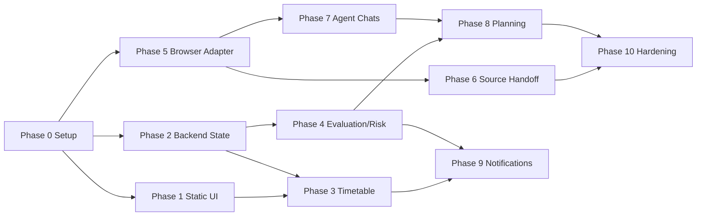

# Semester Operations Command Center
# Phase-Wise Execution Plan

Version: 1.0  
Purpose: executable build roadmap for a four-person hackathon team  
Source architecture: `docs/Semester_Operations_Command_Center_SDD.md`  

## 0. Execution Philosophy

The team should build the system in the order that creates usable value fastest.

Do not start with the hardest AI pieces. Start with the semester operations backbone:

1. data model,
2. timetable,
3. current/next class,
4. evaluation plan,
5. marks and risk,
6. dashboard,
7. source workspace handoff,
8. agent chats,
9. planning automation.

The early phases should feel useful even if AI/browser automation is not connected yet. The later phases should enhance an already-working command center rather than rescue an empty shell.

## 1. Team Ownership

Person 1, Chief Architect:

- repo architecture,
- interfaces,
- browser framework adapter,
- connected chat/source workspace integration,
- master orchestration,
- final integration,
- code review.

Person 2, AI Systems:

- agent prompts,
- agent registry,
- connected chat agent setup,
- planning/evaluation/risk logic,
- knowledge metadata,
- agent tests.

Person 3, Frontend:

- command center UI,
- onboarding screens,
- timetable/calendar,
- grades/risk views,
- chat UI,
- responsive visual polish.

Person 4, Infrastructure/Backend:

- backend API,
- database,
- auth,
- workers,
- document handoff plumbing,
- notifications,
- Docker/CI/testing.

## 2. Phase Overview

| Phase | Name | Goal | Difficulty | Value |
|---|---|---|---|---|
| 0 | Setup and Contracts | Make the team able to build without confusion | Easy | Critical |
| 1 | Static Command Center | Useful UI with seeded data | Easy | High |
| 2 | Backend State Backbone | Real API and database | Medium | Critical |
| 3 | Timetable and Calendar Intelligence | Current/next class and weekly schedule | Easy-Medium | Very High |
| 4 | Evaluation, Marks, GPA, Risk | Core academic utility | Medium | Very High |
| 5 | Source Workspace Handoff | Upload files through browser framework, no local storage | Hard | High |
| 6 | Connected Chat Agents | Use separate chat conversations as agents | Hard | High |
| 7 | Study Planning and Recommendations | Generate plans from state | Medium-Hard | High |
| 8 | Notifications and Daily Briefing | Reminders and proactive command center | Medium | Medium-High |
| 9 | Demo Hardening and Deployment | Make it stable and presentable | Medium | Critical |
| 10 | Post-MVP Evolution | Add robustness without redesign | Hard | Future |

## 3. Execution Rules

### 3.1 Phase Gate Rule

Each phase has a gate. A phase is not considered complete because code exists; it is complete only when the demoable behavior works.

Gate format:

```text
Can a user or teammate see/use the feature without reading code?
Can another developer build the next phase on top of it?
Can the feature survive refresh/restart where persistence is expected?
Are failure states visible?
```

### 3.2 Ticket Rule

Every phase should be broken into tickets using this format:

```text
[Phase X][Owner] Verb + object

Example:
[Phase 4][Backend] Implement marks-needed calculation endpoint
[Phase 5][Browser] Add JSON CLI command for send-chat-message
[Phase 7][AI] Create planning-agent bootstrap prompt
```

Ticket body should include:

- what to build,
- input/output contract,
- files/folders touched,
- test or manual verification,
- dependency ticket if any.

### 3.3 Merge Rule

No phase should wait for every person to finish perfectly. Merge vertical slices.

Preferred merge order:

1. contracts/schema,
2. backend endpoint with mock data,
3. frontend consuming endpoint,
4. worker/agent/browser integration,
5. error states and tests.

### 3.4 Avoidance Rule

When unsure, avoid:

- new frameworks,
- local document knowledge storage,
- hidden business logic in frontend,
- direct browser calls outside Person 1 boundary,
- autonomous agent actions without confirmation,
- building production infra before demo flow works.

## 4. Per-Person Workstream By Phase

| Phase | Person 1 Chief Architect | Person 2 AI Systems | Person 3 Frontend | Person 4 Infra/Backend |
|---|---|---|---|---|
| 0 | Repo, contracts, review rules | Prompt folders | Vite shell | Docker, backend health |
| 1 | DTO review | Seed academic logic notes | Static command center | Shared seed schema |
| 2 | API contract governance | State summary requirements | API integration | DB, auth, state APIs |
| 3 | Calendar contract review | Priority rules | Timetable UI | Calendar/timetable services |
| 4 | Review grade formulas | Risk/marks heuristics | Grades/risk views | Evaluation APIs/tests |
| 5 | Browser adapter | Agent transport requirements | Connection UI | Worker calls Python CLI |
| 6 | Source upload runtime | Subject-workspace mapping | Upload/status UI | Handoff service/cleanup |
| 7 | Agent routing integration | Agent chats/prompts | Chat UI/progress | AgentRunner persistence |
| 8 | Final orchestration review | Planning logic | Plan UI | Plan persistence/events |
| 9 | Integration checks | Briefing rules | Notification UI | Notification worker |
| 10 | Demo branch/final merge | Prompt hardening | Polish | Deploy/smoke tests |

## 5. Priority Rule If Time Is Short

If the team has only 48 to 72 hours, build this reduced slice:

1. Phase 0: repo and contracts.
2. Phase 1: static command center.
3. Phase 3: current/next class.
4. Phase 4: marks, SGPA scenario, risk cards.
5. Phase 5: browser `send-chat-message` proof.
6. Phase 7: one Planning Agent chat.
7. Phase 10: demo hardening.

Skip temporarily:

- document handoff,
- source workspace upload,
- notifications,
- graph visualization,
- multiple agents.

This reduced slice still proves the product: semester command center plus one browser-driven connected AI workflow.

## Phase 0: Setup and Contracts

### Goal

Create the skeleton that prevents chaos. Everyone should know where code goes, what interfaces exist, and how to run the app locally.

### Build This First Because

This phase is easy and removes future coordination cost. Without this, four people will build incompatible pieces.

### What To Build

Repository structure:

```text
semester-operations-command-center/
  frontend/
  backend/
  agents/
  browser/
  shared/
  database/
  deployment/
  docs/
  interfaces/
```

Core files:

- `README.md`
- `.env.example`
- `deployment/docker-compose.yml`
- `shared/README.md`
- `interfaces/Interface.md`
- `configs/agents.registry.example.json`
- `browser/README.md`
- `backend/README.md`
- `frontend/README.md`

### How To Build

Person 1:

- creates repo layout,
- copies SDD and interface docs,
- creates branch rules,
- creates PR template,
- freezes naming: Semester Operations Command Center, `SemesterOperationsState`.

Person 4:

- adds Docker Compose with Postgres and Redis,
- adds backend empty app with `/health`,
- adds migration tooling.

Person 3:

- creates Vite React TypeScript app,
- adds routing shell.

Person 2:

- creates `agents/README.md`,
- creates initial prompt folders:
  - `master-orchestrator`,
  - `initialization-agent`,
  - `planning-agent`,
  - `evaluation-agent`,
  - `source-workspace-agent`.

### Knows

- Product is a command center, not a digital twin.
- Uploaded academic files are transient handoff material.
- Browser framework is local Playwright wrapper, not ordinary REST API.
- Agents are persistent connected chat conversations in MVP.

### Done When

- `docker compose up` starts Postgres, Redis, backend.
- frontend opens locally.
- `/health` returns OK.
- everyone can identify their folders.
- no one is blocked on stack decisions.

### Do Not Build Yet

- document upload,
- browser automation,
- agents,
- prediction models,
- polished UI.

## Phase 1: Static Command Center

### Goal

Make the app visibly useful without backend complexity.

### Build This Early Because

The existing Semester Ops app already proved that timetable, quick access, and current/next class are immediately valuable. This phase creates confidence and gives the frontend/backend a target shape.

### What To Build

Frontend-only static views using local seed JSON:

- Command Center dashboard.
- Weekly timetable.
- Current class / next class widget.
- Subject cards.
- Evaluation summary placeholder.
- Source workspace status placeholder.
- Quick actions placeholder.

Seed data:

- subjects,
- timetable,
- sample evaluation plan,
- sample marks,
- source workspace links where available.

### How To Build

Person 3:

- builds layout:
  - left nav,
  - top command bar,
  - dashboard grid,
  - subject view,
  - calendar/timetable view.
- uses `frontend/src/seed/semester.seed.ts`.
- implements deterministic current/next class calculation client-side for now.

Person 4:

- defines the same seed shape in `shared/schemas`.

Person 1:

- reviews UI data shape so it matches future API DTOs.

### Knows

The goal is not final frontend architecture. It is to create a usable visual prototype with real semester data.

### Done When

- dashboard shows today's classes.
- weekly timetable works.
- current/next class widget works.
- subject cards render.
- app works on laptop and mobile width.

### Do Not Build Yet

- login,
- database persistence,
- source workspace upload,
- AI chat.

## Phase 2: Backend State Backbone

### Goal

Replace seed-only frontend data with a real backend and database.

### Build This Now Because

Everything else depends on canonical semester state. This is the real product foundation.

### What To Build

Backend modules:

- auth minimal,
- users,
- profile,
- semester,
- subjects,
- timetable import,
- state summary.

Database tables:

- users,
- student_profiles,
- semester_operations_states,
- semesters,
- subjects,
- calendar_events,
- source_workspaces,
- document_handoffs,
- audit_logs.

APIs:

- `POST /api/v1/auth/register`
- `POST /api/v1/auth/login`
- `GET /api/v1/state`
- `GET /api/v1/state/detail`
- `POST /api/v1/semesters`
- `GET /api/v1/semesters`
- `POST /api/v1/semesters/{semesterId}/subjects`
- `POST /api/v1/timetable/import`
- `GET /api/v1/calendar/events`

### How To Build

Person 4:

- builds Fastify backend,
- adds Prisma schema,
- adds migrations,
- adds auth middleware,
- adds Zod validation,
- adds repository layer.

Person 3:

- replaces local seed reads with TanStack Query API calls.
- keeps seed fallback if backend is offline.

Person 1:

- enforces DTO names and error envelope.

### Knows

Keep backend boring. This phase should be CRUD plus state projection, not AI.

### Done When

- user can log in.
- seeded semester can be created in DB.
- frontend loads subjects/timetable from API.
- `GET /state` returns dashboard summary.
- error responses follow the shared envelope.

### Do Not Build Yet

- complex prediction,
- browser automation,
- agent orchestration.

## Phase 3: Timetable and Calendar Intelligence

### Goal

Make the system a strong timetable and daily operations app.

### Build This Early Because

It is easy, useful, demo-friendly, and low-risk. This is the foundation of the command-center feeling.

### What To Build

Features:

- weekly timetable CRUD/import,
- current class,
- next class,
- day timeline,
- upcoming academic events,
- free time windows,
- simple calendar event creation.

APIs:

- `GET /api/v1/calendar/events?from=&to=`
- `POST /api/v1/calendar/events`
- `PATCH /api/v1/calendar/events/{eventId}`
- `DELETE /api/v1/calendar/events/{eventId}`

State projection:

- `currentClass`,
- `nextClass`,
- `todaySchedule`,
- `upcomingEvents`,
- `freeWindows`.

### How To Build

Person 4:

- implements calendar query service.
- implements timetable recurrence expansion.

Person 3:

- builds calendar/timetable UI.
- builds current/next class widget from API.

Person 2:

- defines simple priority rules:
  - class in progress,
  - assessment within 7 days,
  - assignment due within 3 days.

### Knows

Do current/next class on backend now. Frontend displays results only.

### Done When

- backend can answer “what is happening now?”
- frontend shows today and week clearly.
- events survive refresh.
- mobile view remains usable.

### Do Not Build Yet

- external calendar sync,
- notifications,
- advanced planning.

## Phase 4: Evaluation, Marks, GPA, and Risk

### Goal

Deliver the highest academic utility: marks tracking, evaluation plan, grade projection, and risk.

### Build This Now Because

This is the main reason the app is more than a timetable. It makes the command center academically useful even without AI agents.

### What To Build

Database:

- evaluation_plans,
- assessments,
- marks,
- goals,
- risk_scores,
- predictions.

Features:

- create evaluation plan per subject,
- add assessments,
- record marks,
- compute marks lost,
- compute subject progress,
- compute simple SGPA scenario,
- compute marks needed,
- risk severity cards.

APIs:

- `POST /api/v1/subjects/{subjectId}/evaluation-plan`
- `GET /api/v1/subjects/{subjectId}/evaluation-plan`
- `POST /api/v1/assessments`
- `PATCH /api/v1/assessments/{assessmentId}/marks`
- `GET /api/v1/grades/sgpa-scenarios`
- `GET /api/v1/risk`
- `POST /api/v1/risk/recompute`

### How To Build

Person 2:

- defines deterministic formulas:
  - marks lost = max marks - obtained marks,
  - completion percentage,
  - remaining marks,
  - target marks needed,
  - risk by gap to target and upcoming assessments.
- avoids ML in MVP.

Person 4:

- implements formulas in backend services.
- writes unit tests.

Person 3:

- builds grades view:
  - subject progress,
  - assessment table,
  - risk cards,
  - what-if input.

### Knows

Prediction can be heuristic. The MVP does not need a trained model.

Risk heuristic example:

```text
HIGH if target gap is large and high-weight assessment is within 7 days.
MEDIUM if marks lost trend threatens subject target.
LOW if current progress is above target path.
```

### Done When

- user can enter marks.
- marks lost updates instantly.
- grade projection updates.
- risk cards explain why they exist.
- unit tests cover SGPA and marks-needed calculations.

### Do Not Build Yet

- LLM-generated grade predictions,
- fancy graph analytics,
- automated scraping of marks.

## Phase 5: Browser Framework Adapter and Account Connection

### Goal

Connect the product to the existing Browser Automation Framework safely and practically.

### Build This After Core State Because

Browser automation is harder and more fragile. It should attach to a working app, not be the app's foundation.

### What To Build

Browser wrapper:

- `browser/framework/adapter_loader.py`
- `browser/framework/browser_session.py`
- `browser/framework/chat_runtime.py`
- `browser/framework/response_collector.py`
- `browser/runner/browser_framework_cli.py`

Backend adapter:

- `services/browser/BrowserFrameworkAdapter.ts`

Capabilities:

- initialize session,
- import cookies,
- open target URL,
- send chat message,
- collect response,
- get status.

Connection UI:

- connect AI chat workspace,
- connect source notebook workspace,
- manual login status,
- cookies.json import status.

### How To Build

Person 1:

- refactors `Browser API/poc.py` without changing its core logic.
- makes a JSON-in/JSON-out CLI.
- adds adapter JSON files.
- documents profile directories.

Person 4:

- calls Python CLI from backend worker.
- records browser operation status in DB.

Person 3:

- builds connection screens and status badges.

### Knows

MVP recommended account connection:

1. persistent browser profile login,
2. cookies.json import for fast setup,
3. OAuth only for providers with official APIs later.

Do not store credentials. Do not commit cookies. Do not expose profile paths.

### Done When

- backend can call `sendChatMessage` through adapter.
- browser opens authenticated profile.
- cookies import can be tested locally.
- UI shows `READY`, `AWAITING_LOGIN`, `EXPIRED`, or `ERROR`.

### Do Not Build Yet

- source workspace upload automation,
- all agents,
- production browser worker hosting.

## Phase 6: Source Workspace Handoff

### Goal

Allow the user to upload academic files during onboarding/import, route them to the right subject workspace, and delete local raw files.

### Build This After Browser Adapter Because

This is where your browser framework becomes useful for the product, but it depends on Phase 5.

### What To Build

Backend:

- `DocumentHandoffService`,
- transient file staging,
- cleanup worker,
- source workspace metadata,
- handoff retry.

APIs:

- `POST /api/v1/document-handoffs`
- `GET /api/v1/document-handoffs`
- `POST /api/v1/document-handoffs/{documentHandoffId}/retry`
- `POST /api/v1/source-workspaces`
- `POST /api/v1/source-workspaces/{sourceWorkspaceId}/sources`
- `GET /api/v1/source-workspaces/{sourceWorkspaceId}/status`

Browser framework:

- create/open subject source workspace,
- upload staged file,
- confirm upload status.

Frontend:

- upload UI per subject,
- status: queued, uploading, completed, failed, expired,
- retry button,
- manual source workspace link.

### How To Build

Person 1:

- adds source workspace adapter JSON and upload runtime.

Person 4:

- adds file staging and cleanup.
- enforces max retention.

Person 3:

- builds upload and status flow.

Person 2:

- defines subject-to-workspace mapping rules.

### Knows

Allowed content path:

```text
upload -> transient staging -> browser upload -> external workspace -> delete local file -> store metadata
```

Forbidden:

```text
upload -> parse chunks -> store text -> build local RAG
```

### Done When

- file can be uploaded to subject workspace.
- staged local file is deleted after success.
- metadata remains.
- failed handoff can be retried.
- user can manually paste workspace URL if automation fails.

### Do Not Build Yet

- local document Q&A,
- source text extraction,
- full knowledge graph extraction from files.

## Phase 7: Connected Chat Agents

### Goal

Create practical AI agents using dedicated connected chat conversations controlled by the browser framework.

### Build This After Browser Messaging Works Because

Agents are just structured usage of connected chat. The transport must work before agent logic matters.

### What To Build

Agent registry:

- `configs/agents.registry.json`

Agents:

- Master Orchestrator,
- Initialization Agent,
- Evaluation Agent,
- Planning Agent,
- Source Workspace Agent.

Backend:

- `ConnectedChatService`,
- `AgentRunner`,
- JSON output validator,
- one repair retry,
- `agent_runs` table.

Frontend:

- chat UI,
- agent progress,
- final answer display,
- action proposal display.

### How To Build

Person 2:

- writes bootstrap prompts.
- creates one chat per agent.
- stores chat URLs.
- writes expected output schemas.

Person 1:

- validates browser framework can open target chat URLs and send messages reliably.

Person 4:

- implements `AgentRunner`.
- validates output with Zod.

Person 3:

- builds chat surface and SSE progress.

### Knows

Each agent is a real persistent chat.

Runtime pattern:

```text
backend job -> agent registry -> browser open chat URL -> send agentTask JSON -> collect response -> validate JSON -> submit proposed commands
```

### Done When

- planning agent returns valid JSON.
- evaluation agent returns valid JSON.
- master orchestrator can route at least:
  - “What should I study today?”
  - “What is my grade risk?”
  - “Ask my OS source workspace about semaphores.”
- invalid JSON is retried once with repair prompt.

### Do Not Build Yet

- every possible agent,
- autonomous multi-step workflows without confirmation,
- background self-running agents.

## Phase 8: Study Planning and Recommendations

### Goal

Turn state into useful daily/weekly plans.

### Build This After Marks/Risk and Agents Because

Planning needs state and benefits from agent reasoning. But the deterministic fallback should work even if agents fail.

### What To Build

Features:

- generate daily plan,
- generate weekly plan,
- recommend study blocks,
- recommend subject focus,
- show why each recommendation exists,
- accept plan into calendar/tasks.

APIs:

- `POST /api/v1/plans/generate`
- `GET /api/v1/plans/current`
- `PATCH /api/v1/plans/{planId}/tasks/{taskId}`

Planning inputs:

- timetable,
- free windows,
- upcoming assessments,
- assignments,
- marks lost,
- risk scores,
- user goals.

### How To Build

Person 2:

- creates deterministic planning heuristic first.
- then adds Planning Agent enhancement.

Person 4:

- persists plan/tasks.
- creates events on accept.

Person 3:

- builds plan view and accept/edit UI.

### Knows

The plan must be explainable.

Example recommendation:

```text
Study OS for 45 minutes today because OS MSE is in 5 days and your current OS risk is HIGH due to 6 marks lost in CA.
```

### Done When

- user can generate a plan.
- each item has reason.
- user can accept or edit items.
- accepted items appear on calendar.

### Do Not Build Yet

- fully autonomous calendar modification,
- complex optimization engine,
- learning-style personalization.

## Phase 9: Notifications and Daily Briefing

### Goal

Make the command center proactive without becoming noisy.

### Build This Later Because

Notifications are only useful after timetable, risk, deadlines, and planning are reliable.

### What To Build

Notifications:

- in-app notification inbox,
- reminders for assessments,
- risk alerts,
- source workspace upload failure alerts,
- plan reminders.

Briefing:

- today's schedule,
- top three priorities,
- risk changes,
- upcoming deadlines,
- recommended action.

APIs:

- `GET /api/v1/notifications`
- `PATCH /api/v1/notifications/{notificationId}`
- `POST /api/v1/notifications/test`

### How To Build

Person 4:

- notification table,
- scheduler worker,
- in-app notification delivery.

Person 2:

- briefing template and prioritization rules.

Person 3:

- notification inbox,
- dashboard alert cards.

### Knows

Start with in-app notifications. Push/email can wait.

### Done When

- notification appears for assessment within configured threshold.
- risk threshold creates alert.
- user can dismiss/snooze.
- daily briefing card exists.

### Do Not Build Yet

- SMS,
- complex push notification infra,
- external calendar sync.

## Phase 10: Demo Hardening and Deployment

### Goal

Make the MVP reliable enough to demo and hand over.

### Build This Before Adding More Features

A stable smaller product beats a broad broken product.

### What To Build

Demo script:

1. Login.
2. View command center.
3. See current/next class.
4. Enter marks.
5. See risk update.
6. Upload file to subject workspace.
7. Ask connected chat/agent for plan.
8. Accept plan.
9. See notification/briefing.

Hardening:

- seed data reset script,
- browser profile readiness checklist,
- source workspace fallback links,
- error states,
- loading states,
- smoke tests,
- deploy docs.

### How To Build

Person 1:

- runs end-to-end integration.
- freezes demo branch.

Person 2:

- tests agent prompts and repair prompts.

Person 3:

- visual polish and responsive checks.

Person 4:

- deployment and smoke tests.

### Done When

- demo script works twice in a row.
- no raw uploaded files remain after successful handoff.
- app can recover from source workspace failure with manual link.
- README explains setup.
- smoke tests pass.

## Phase 11: Post-MVP Evolution

### Goal

Improve without redesigning.

### Add Later

- external calendar sync,
- official OAuth integrations where available,
- mobile PWA polish,
- advanced analytics,
- richer concept graph,
- attendance import,
- better notification channels,
- optional local knowledge mode with explicit user consent,
- production deployment of browser worker,
- multi-user support.

### Do Not Add Without Explicit Decision

- automatic credential entry,
- storing raw lecture documents,
- local RAG over uploaded files,
- autonomous destructive actions,
- scraping institutional systems without a clear consent/security model.

## 16. Recommended Calendar Timeline

### 7-Day Hackathon Version

Day 1:

- Phase 0 and start Phase 1.
- Repo, contracts, Docker Compose, frontend shell.

Day 2:

- Finish Phase 1.
- Start Phase 2.
- Seeded dashboard and backend state APIs.

Day 3:

- Finish Phase 2.
- Phase 3 timetable/calendar.

Day 4:

- Phase 4 evaluation/marks/risk.

Day 5:

- Phase 5 browser framework adapter.
- Start Phase 6 handoff.

Day 6:

- Phase 6 handoff.
- Phase 7 first connected chat agents.

Day 7:

- Phase 8 basic planning.
- Phase 10 hardening/demo.
- Skip Phase 9 if short on time.


## 17. Phase Dependencies



## 18. Cut Lines

If the team is running out of time, cut in this order:

1. External push/email notifications.
2. Knowledge graph visualization.
3. Analytics page.
4. Source workspace query.
5. Multi-agent routing beyond Master + Planning + Evaluation.
6. Source workspace creation automation.

Do not cut:

- timetable,
- current/next class,
- evaluation/marks,
- risk cards,
- browser framework adapter proof,
- source handoff cleanup rule,
- demo flow.

## 19. MVP Definition

The MVP is acceptable if it does these things:

- shows the student what is happening today,
- tracks subjects and timetable,
- tracks evaluation plans and marks,
- computes useful grade/risk summaries,
- connects to the browser framework,
- uploads at least one file to a subject source workspace without retaining it locally,
- uses at least one connected chat agent for planning or evaluation,
- generates a basic study plan,
- looks like a command center, not a generic dashboard.

## 20. Final Build Advice

Build boring foundations first. Make the app useful before making it intelligent.

The best execution order is:

```text
state -> timetable -> marks -> risk -> dashboard -> browser adapter -> handoff -> agents -> planning -> notifications -> polish
```

This gives the team a working product at every checkpoint and prevents the project from becoming a pile of unfinished AI integrations.
