# Semester Operations Command Center
# Implementation-Grade Software Design Document

Document status: Implementation baseline for hackathon MVP  
Product owner: Student operator / academic command center owner  
Primary audience: Four-engineer build team  
Version: 1.0  
Last updated: 2026-07-22  

## 1. Executive Summary

Semester Operations Command Center is a persistent academic management platform for running a student's semester from one mission-control surface. It is not a generic "digital twin" product, a timetable-only app, a notebook, or an AI wrapper. It is a semester operations layer that keeps academic structure, deadlines, grades, timetable, goals, reminders, and AI-assisted workflows coordinated through one state model.

The system stores operational academic data: semester structure, timetable, evaluation plans, deadlines, attendance, grades, goals, preferences, study history, task state, risk state, and integration metadata. It does not store uploaded lecture documents as a private knowledge base. During initialization and document import, user-provided academic content is used as transient handoff material: the system routes it to the required subject workspace through the Browser Automation Framework, records metadata/status, and then discards local raw content after the handoff succeeds.

External AI tools are treated as connected workspaces. The product should not over-market their names in the UI or internal architecture. This document uses neutral names where possible:

- Source Notebook Workspace: the external source-grounded study workspace used per subject.
- Connected AI Chat Workspace: the user's authenticated chat account and its memory-enabled conversations.
- Browser Automation Framework: the local Playwright-based framework that drives authenticated browser sessions.

The product is the management platform and its canonical `SemesterOperationsState`.

The MVP must prove one high-value loop:

1. A student onboards conversationally.
2. The system ingests timetable, subjects, evaluation plan, and lecture material.
3. The system creates or links a Source Notebook Workspace per subject through the Browser Automation Framework.
4. The system builds initial `SemesterOperationsState`.
5. The dashboard shows today's schedule, priorities, risk, deadlines, and knowledge state.
6. The student asks questions or requests planning.
7. Agents reason from operational state, use connected chat memory where useful, delegate source-grounded questions to subject workspaces, and produce explainable actions.

The architecture is intentionally modular. Hackathon implementation can run as a small monorepo with one backend service, one frontend, one database, one queue, and black-box browser worker. Production can evolve toward separately deployable services without changing the domain contracts.

## 2. Source Artifact Interpretation

This SDD is derived from the uploaded design artifacts and project code. It does not rewrite them. It extracts their reusable engineering philosophy.

### 2.1 Browser Session Virtualization Layer SDD

Reusable principles:

- Browser execution is separate from product experience.
- Persistent browser profiles provide session continuity and isolation.
- Site-specific behavior belongs in adapters/configuration, not product logic.
- The frontend never touches browser state directly.
- Backends call clean service contracts and receive explicit lifecycle statuses.
- Automation failures must surface as typed states, not hidden exceptions.

Binding decision:

- Browser Session Virtualization Layer is core IP.
- This SDD never exposes internal implementation.
- The project consumes it through a thin `BrowserFrameworkAdapter`, not by importing browser internals into product code.
- Only Person 1 may edit Browser Automation Framework contracts.

### 2.2 Browser Automation Project

Observed conventions:

- `site_adapter.json` externalizes selectors and timing.
- `poc.py` uses persistent profile directories keyed by session/user identity.
- Completion is detected through explicit generation indicators and text stability.
- Human login is allowed and expected when external sites require it.

Reusable pattern:

- Treat every external web UI as a capability exposed through a typed framework adapter.
- Keep DOM selectors, timing rules, and login behavior outside product domains.

### 2.3 Semester Operations System SDD

Reusable principles:

- Command-center UX over ordinary dashboard UX.
- Configuration-driven entries for subjects, roles, resources, links, and priorities.
- Phased delivery: static operational view first, then live assistant, then intelligent recommendations.
- External source workspace and chat workspaces are tools, not replacements for the operations layer.
- Calendar, tasks, progress, quick launches, and status are separate modules.

### 2.4 Semester Operations Project

Observed implementation:

- Static PWA-style web app using a JSON configuration source.
- Timetable entries include day, time, subject, type, faculty, and room.
- Local to-do and alarm state exist but are not domain-backed.
- Current/next class logic is client-side and should move to backend domain logic for `SemesterOperationsState`.

Reusable data:

- Subjects: SML, DCDS, OS, DS, DM, CCE.
- Existing source notebook links for subjects.
- Weekly timetable structure.
- Leadership/professional/project contexts that may later be modeled as non-academic workloads.

### 2.5 Semester Evaluation Plan

Reusable domain model:

- Assessments are date-bound and subject-bound.
- Each assessment has a type, marks, score, CA/ESE category, and marks lost.
- Subjects have credit weights and total marks.
- SGPA targets can be scenario-tested.
- Risk prediction must use marks lost, remaining marks, due dates, subject credit, and target grade.

Important extracted entities:

- EvaluationPlan
- Assessment
- Marks
- GradeTarget
- RiskScenario
- SubjectCredit
- MarksLost

## 3. Product Definition

### 3.1 Product Statement

Semester Operations Command Center is a student-state management platform that continuously organizes, updates, and reasons over a student's semester operations.

### 3.2 Non-Goals

The system must not become:

- A simple planner.
- A timetable-only app.
- A notebook app.
- A wrapper around a connected AI chat product.
- A wrapper around a source notebook product.
- A browser automation product.
- A generic learning management system.

### 3.3 Core Philosophy

Everything revolves around one object:

`SemesterOperationsState`

All modules either:

- Ingest operational information into semester state.
- Query semester state.
- Reason over semester state.
- Mutate semester state through commands/events.
- Present semester state to the user.
- Execute external workspace actions on behalf of the user.

No feature should create a separate source of truth for academic state.

## 4. Architecture Principles

### 4.1 Design Principles

- Domain-Driven Design: academic concepts are first-class domain objects.
- Clean Architecture: domain logic does not depend on UI, browser automation, vendors, or frameworks.
- Interface-first integration: every cross-module call uses typed interfaces.
- Dependency Injection: services consume abstractions, not concrete clients.
- Repository Pattern: persistence is hidden behind repositories.
- Event Driven Architecture: important state changes publish events.
- CQRS where useful: commands mutate state; queries read optimized projections.
- Auditability: all agent decisions and important mutations are traceable.
- Progressive enhancement: MVP choices must not block production evolution.
- Black-box automation: BrowserFrameworkAdapter is an external capability boundary.

### 4.2 Architectural Invariants

- `SemesterOperationsState` is the canonical aggregate.
- UI never calls agents directly.
- UI never calls the Browser Automation Framework directly.
- Agents never write database tables directly.
- Agents mutate state through domain services or command handlers.
- Browser automation internals are never imported by backend modules.
- Source Notebook Workspace actions are accessed only through `SourceNotebookService`, which delegates execution to `BrowserFrameworkAdapter`.
- Prompt templates are versioned files, not hidden strings inside code.
- All AI responses that change state must produce structured output and audit logs.
- Every external side effect must be idempotent or guarded by an idempotency key.

### 4.3 Hackathon Constraint

The MVP can be implemented with fewer processes than the production architecture, but it must preserve the same interfaces. The allowed MVP simplification is deployment topology, not architectural coupling.

## 5. System Context Diagram

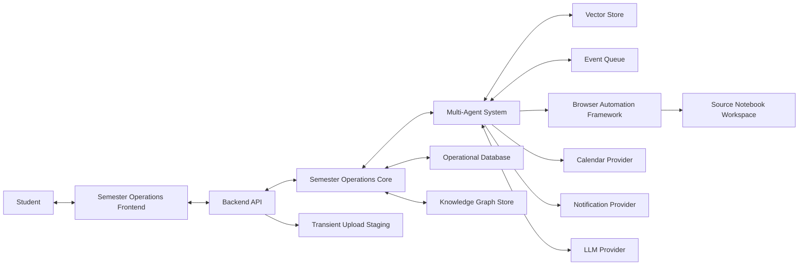

## 6. Container Diagram

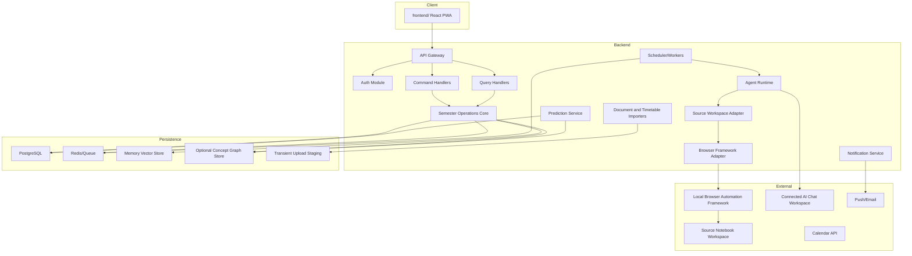

## 7. Component Diagram

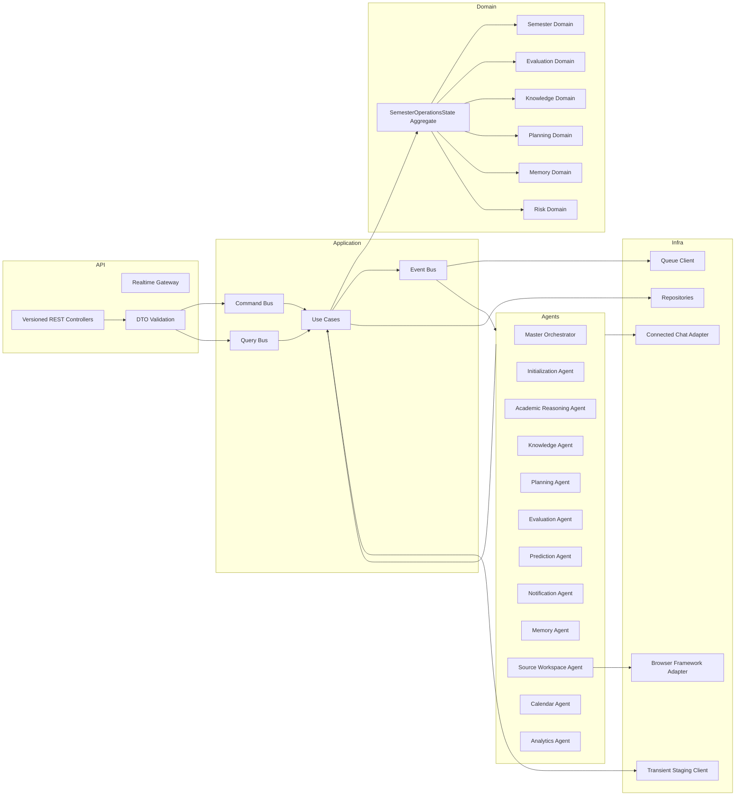

## 8. Runtime Architecture

### 8.1 MVP Runtime

- One frontend PWA.
- One backend API process.
- One worker process for scheduled jobs and async agent tasks.
- PostgreSQL for structured state.
- Redis or BullMQ-compatible queue for async work.
- Transient local filesystem staging for uploaded files; raw files are deleted after handoff to the subject workspace.
- Qdrant/pgvector is optional and used for agent memory and operational summaries only, not for storing lecture document content.
- Neo4j optional; fallback to Postgres graph tables for concept/status metadata.
- Browser Automation Framework runs locally as Person 1's Playwright framework, wrapped by a `BrowserFrameworkAdapter`.

### 8.2 Production Runtime

- Frontend deployed through CDN.
- API gateway and backend services deployed as containers.
- Agents may be split into separately scalable workers.
- Queue is managed Redis, RabbitMQ, or cloud-native task queue.
- Postgres is managed and multi-AZ.
- Vector store is managed Qdrant/Pinecone/pgvector cluster for memory and embeddings of operational summaries.
- Knowledge graph is Neo4j Aura or equivalent graph store for concepts, assessments, and dependencies, not raw document chunks.
- Upload staging is encrypted S3/GCS/Azure Blob with short retention policies.
- Browser Automation Framework may remain isolated as a worker/service boundary, but the product treats it as a framework adapter owned by Person 1.

## 9. Repository Structure

The repository is a monorepo. Every folder has a clear owner and boundary.

```text
semester-operations-command-center/
  frontend/
  backend/
  agents/
  services/
  database/
  interfaces/
  configs/
  prompts/
  deployment/
  docs/
  tests/
  browser/
  shared/
  scripts/
```

### 9.1 `frontend/`

Owner: Person 3  
Purpose: Mission-control dashboard and chat UI.

Contains:

- React app or equivalent frontend.
- UI components.
- Routes.
- State management.
- API client wrappers generated from shared contracts.
- Dashboard visualizations.
- Calendar and knowledge graph visualization.
- Chat interface.

Must never contain:

- Business rules for risk, GPA, planning, or academic state mutation.
- Browser automation logic.
- API secrets.
- Agent prompts.
- Direct database access.

### 9.2 `backend/`

Owner: Person 4, with architecture review by Person 1  
Purpose: Versioned REST API, auth, command/query handlers, domain orchestration.

Contains:

- Controllers.
- DTO validation.
- Command handlers.
- Query handlers.
- Domain services.
- Dependency injection container.
- Auth and authorization middleware.
- Repositories interfaces and infrastructure bindings.

Must never contain:

- Frontend components.
- Browser automation internals.
- Raw prompt engineering hidden inside services.
- Source Notebook Workspace DOM assumptions.

### 9.3 `agents/`

Owner: Person 2  
Purpose: Agent implementations, routing policies, structured outputs, agent tests.

Contains:

- Master orchestrator.
- Initialization agent.
- Planning agent.
- Knowledge agent.
- Evaluation agent.
- Prediction agent.
- Notification agent.
- Memory agent.
- Source Workspace Agent wrapper.
- Agent input/output schemas.
- Agent evaluation fixtures.

Must never contain:

- API route handlers.
- Direct DB writes except through approved repositories/domain services.
- Browser automation internals.
- UI code.

### 9.4 `services/`

Owner: Person 1 for BrowserFrameworkAdapter client and integration shell; Person 4 for other service clients  
Purpose: External and internal service adapters.

Contains:

- `browser/BrowserFrameworkAdapter`.
- `source-workspace/SourceNotebookService`.
- `calendar/CalendarService`.
- `notification/NotificationService`.
- `llm/LLMService`.
- `storage/ObjectStorageService`.
- `embedding/EmbeddingService`.

Must never contain:

- Core domain entities.
- Controller validation.
- Feature-specific UI logic.
- Site-specific selectors for Browser Automation.
- raw user-uploaded lecture content after handoff.

### 9.5 `database/`

Owner: Person 4  
Purpose: Schemas, migrations, seeds, database diagrams, repository mappings.

Contains:

- SQL migrations.
- ERD source.
- seed data for sample semester.
- database README.
- local dev compose files if needed.

Must never contain:

- Application business logic.
- Agent prompts.
- Browser code.

### 9.6 `interfaces/`

Owner: Person 1  
Purpose: Source of truth for service contracts.

Contains:

- `Interface.md`.
- OpenAPI specs.
- JSON schemas.
- event schemas.
- DTO definitions.
- domain model references.
- ownership matrix.

Must never contain:

- Implementation code.
- Secrets.
- Generated build artifacts.

### 9.7 `configs/`

Owner: Person 1 for global config structure, Person 4 for environment templates  
Purpose: Runtime configuration that is not secret.

Contains:

- environment templates.
- feature flags.
- subject extraction mappings.
- risk threshold defaults.
- notification defaults.

Must never contain:

- API keys.
- OAuth client secrets.
- BrowserFrameworkAdapter internal configs.

### 9.8 `prompts/`

Owner: Person 2  
Purpose: Versioned prompt templates and output schemas.

Contains:

- Prompt files per agent.
- Prompt changelog.
- evaluation rubrics.
- prompt test cases.

Must never contain:

- Business secrets.
- Hardcoded user data.
- Browser selectors.
- Framework code.

### 9.9 `deployment/`

Owner: Person 4, reviewed by Person 1  
Purpose: Deployment automation.

Contains:

- Dockerfiles.
- Docker Compose.
- Kubernetes manifests for production.
- Terraform for production.
- environment variable documentation.
- CI/CD workflows.

Must never contain:

- Application source code.
- Credentials.
- Browser profile data.

### 9.10 `docs/`

Owner: Person 1  
Purpose: Architecture and product documentation.

Contains:

- This SDD.
- ADRs.
- sequence diagrams.
- onboarding docs.
- runbooks.
- demo script.

Must never contain:

- Secrets.
- Raw private academic documents unless explicitly anonymized.

### 9.11 `tests/`

Owner: Shared; Person 4 owns test infrastructure  
Purpose: Cross-module tests and acceptance fixtures.

Contains:

- Integration tests.
- API tests.
- agent tests.
- UI smoke tests.
- acceptance scenarios.

Must never contain:

- Production credentials.
- Non-deterministic hidden test data.

### 9.12 `browser/`

Owner: Person 1 only  
Purpose: Boundary placeholder for the local black-box Browser Automation Framework integration.

Contains:

- Browser framework adapter specs.
- local framework wrapper scripts.
- mock server for development.
- adapter-independent test doubles.

Must never contain:

- Core Browser Session Virtualization implementation unless Person 1 intentionally vendors it.
- external workspace selectors outside the framework-owned adapter configs.
- credentials.
- browser profile directories committed to Git.

### 9.13 `shared/`

Owner: Person 1 for contract governance, all may consume  
Purpose: Shared types used by frontend, backend, and agents.

Contains:

- TypeScript types.
- schema exports.
- generated API clients.
- event enums.
- error codes.

Must never contain:

- Runtime-specific code.
- React components.
- database migrations.
- service implementations.

### 9.14 `scripts/`

Owner: Person 4  
Purpose: Developer automation.

Contains:

- seed scripts.
- import scripts.
- validation scripts.
- diagram generation.
- local setup helpers.

Must never contain:

- Long-running service code.
- secrets.
- production-only manual operations without review.

## 10. Domain Model

### 10.1 Aggregate Root

`SemesterOperationsState`

Purpose: canonical representation of a student's academic world.

Fields:

- `stateId`
- `userId`
- `activeSemesterId`
- `profile`
- `academicState`
- `knowledgeState`
- `planningState`
- `evaluationState`
- `riskState`
- `memoryState`
- `integrationState`
- `createdAt`
- `updatedAt`
- `version`

Rules:

- All writes to academic state increment `version`.
- All high-impact writes produce an audit event.
- Agent-generated updates must include evidence and confidence.
- The state may reference document handoff records and external source IDs, but must not embed raw file content.

### 10.2 Domain Entities

#### User

Represents an authenticated person using the system.

Key fields:

- `userId`
- `email`
- `displayName`
- `timezone`
- `locale`
- `createdAt`
- `lastLoginAt`
- `status`

#### StudentProfile

Represents academic identity.

Key fields:

- `profileId`
- `userId`
- `institutionName`
- `degree`
- `program`
- `department`
- `batch`
- `currentSemesterNumber`
- `gradingSystem`
- `targetSgpa`
- `currentCgpa`
- `preferences`

#### Semester

Represents one academic term.

Key fields:

- `semesterId`
- `userId`
- `name`
- `number`
- `startDate`
- `endDate`
- `status`
- `targetSgpa`
- `currentSgpaEstimate`

#### Subject

Represents a course or lab.

Key fields:

- `subjectId`
- `semesterId`
- `code`
- `name`
- `shortName`
- `credits`
- `subjectType`
- `faculty`
- `roomDefaults`
- `sourceWorkspaceId`
- `status`

MVP subject seed examples:

- SML: Supervised Machine Learning.
- DCDS: Database Concepts for Data Science.
- OS: Operating Systems.
- DS: Data Structures.
- DM: Discrete Mathematics.
- CCE: Cloud Computing Essentials.

#### Assignment

Represents homework, submissions, lab journals, projects, or other work.

Key fields:

- `assignmentId`
- `subjectId`
- `title`
- `description`
- `assignmentType`
- `dueAt`
- `marks`
- `status`
- `priority`
- `sourceDocumentIds`
- `submissionUrl`

#### EvaluationPlan

Represents grading structure for a subject.

Key fields:

- `evaluationPlanId`
- `semesterId`
- `subjectId`
- `totalMarks`
- `creditWeight`
- `targetMarks`
- `targetGrade`
- `assessmentComponents`
- `createdFromDocumentId`

#### Assessment

Represents one evaluative item.

Key fields:

- `assessmentId`
- `evaluationPlanId`
- `subjectId`
- `name`
- `type`
- `category`
- `marksMax`
- `marksObtained`
- `marksLost`
- `weight`
- `scheduledAt`
- `status`
- `confidence`

Assessment categories:

- `CA`
- `ESE`
- `PRACTICAL`
- `PROJECT`
- `CONTINUOUS`

#### Marks

Represents scored outcome for an assessment.

Key fields:

- `marksId`
- `assessmentId`
- `score`
- `maxScore`
- `normalizedScore`
- `enteredBy`
- `enteredAt`
- `verified`

#### CalendarEvent

Represents all time-bound academic and planning items.

Key fields:

- `calendarEventId`
- `userId`
- `semesterId`
- `subjectId`
- `title`
- `eventType`
- `startAt`
- `endAt`
- `location`
- `recurrenceRule`
- `source`
- `externalCalendarId`
- `status`

#### KnowledgeGraph

Logical container for subject concepts, prerequisite edges, document references, and mastery state.

Key fields:

- `knowledgeGraphId`
- `userId`
- `semesterId`
- `graphVersion`
- `nodeCount`
- `edgeCount`
- `lastRebuiltAt`

#### Concept

Key fields:

- `conceptId`
- `subjectId`
- `name`
- `description`
- `difficulty`
- `sourceDocumentIds`
- `aliases`

#### ConceptRelation

Key fields:

- `relationId`
- `fromConceptId`
- `toConceptId`
- `relationType`
- `weight`
- `evidence`

Relation types:

- `PREREQUISITE_OF`
- `PART_OF`
- `TESTED_BY`
- `MENTIONED_IN`
- `SIMILAR_TO`
- `REMEDIATES`

#### ConceptMastery

Key fields:

- `conceptMasteryId`
- `userId`
- `conceptId`
- `masteryProbability`
- `confidence`
- `lastEvidenceAt`
- `evidenceCount`
- `trend`

#### SemesterOperationsSnapshot

Immutable periodic snapshot.

Key fields:

- `snapshotId`
- `stateId`
- `version`
- `summaryJson`
- `createdAt`
- `reason`

#### Notification

Key fields:

- `notificationId`
- `userId`
- `type`
- `title`
- `body`
- `priority`
- `scheduledAt`
- `sentAt`
- `status`
- `actionUrl`
- `dedupeKey`

#### Goal

Key fields:

- `goalId`
- `userId`
- `semesterId`
- `title`
- `description`
- `goalType`
- `targetMetric`
- `targetValue`
- `currentValue`
- `deadline`
- `status`

#### RiskScore

Key fields:

- `riskScoreId`
- `userId`
- `semesterId`
- `subjectId`
- `riskType`
- `score`
- `severity`
- `drivers`
- `recommendedActions`
- `calculatedAt`
- `modelVersion`

Risk types:

- `LOW_GRADE`
- `MISSED_DEADLINE`
- `ATTENDANCE`
- `KNOWLEDGE_GAP`
- `OVERLOAD`
- `SGPA_TARGET`

#### Prediction

Key fields:

- `predictionId`
- `userId`
- `semesterId`
- `subjectId`
- `predictionType`
- `predictedValue`
- `confidenceInterval`
- `features`
- `createdAt`
- `modelVersion`

#### AcademicState

Denormalized current state for fast reads.

Key fields:

- `academicStateId`
- `stateId`
- `currentClass`
- `nextClass`
- `todayPriorities`
- `openAssignments`
- `upcomingAssessments`
- `riskSummary`
- `lastComputedAt`

#### AuditLog

Key fields:

- `auditLogId`
- `userId`
- `actorType`
- `actorId`
- `action`
- `resourceType`
- `resourceId`
- `beforeHash`
- `afterHash`
- `metadata`
- `createdAt`

#### PromptHistory

Key fields:

- `promptHistoryId`
- `agentId`
- `userId`
- `templateId`
- `templateVersion`
- `inputHash`
- `outputHash`
- `model`
- `latencyMs`
- `tokenUsage`
- `status`
- `createdAt`

#### AgentMemory

Key fields:

- `memoryId`
- `agentId`
- `userId`
- `memoryType`
- `content`
- `embeddingId`
- `importance`
- `expiresAt`
- `createdAt`

#### SourceWorkspace

Represents an external source-grounded workspace. The platform stores linkage and status, not copied source content.

Key fields:

- `workspaceId`
- `userId`
- `subjectId`
- `externalWorkspaceId`
- `title`
- `provider`
- `status`
- `sourceDocumentCount`
- `lastSyncedAt`

#### DocumentHandoff

Represents a transient uploaded file while it is being handed off to the required subject workspace. The platform must not retain raw lecture files as long-term storage.

Key fields:

- `documentHandoffId`
- `userId`
- `semesterId`
- `subjectId`
- `filename`
- `mimeType`
- `transientStagingUri`
- `documentType`
- `checksum`
- `handoffStatus`
- `externalWorkspaceSourceId`
- `stagingExpiresAt`
- `createdAt`

Rules:

- `transientStagingUri` is short-lived and deleted after successful handoff.
- The system may store filename, checksum, subject mapping, external source ID, and processing status.
- The system must not store parsed full text, source chunks, or document embeddings from user academic files unless the user explicitly opts into a future local knowledge mode.

## 11. Database ER Diagram

```mermaid
erDiagram
    USER ||--|| STUDENT_PROFILE : owns
    USER ||--o{ SEMESTER : has
    USER ||--|| SEMESTER_OPERATIONS_STATE : owns
    SEMESTER ||--o{ SUBJECT : contains
    SUBJECT ||--o{ LECTURE : schedules
    SUBJECT ||--o{ ASSIGNMENT : has
    SUBJECT ||--o{ EVALUATION_PLAN : graded_by
    EVALUATION_PLAN ||--o{ ASSESSMENT : contains
    ASSESSMENT ||--o{ MARKS : records
    LECTURE ||--o{ ATTENDANCE_RECORD : tracks
    USER ||--o{ CALENDAR_EVENT : owns
    SUBJECT ||--o{ CALENDAR_EVENT : relates_to
    USER ||--o{ DOCUMENT_HANDOFF : uploads_temporarily
    SUBJECT ||--o{ DOCUMENT_HANDOFF : routes
    USER ||--o{ SOURCE_WORKSPACE : owns
    SUBJECT ||--o{ SOURCE_WORKSPACE : has
    USER ||--o{ GOAL : sets
    USER ||--o{ NOTIFICATION : receives
    USER ||--o{ RISK_SCORE : has
    USER ||--o{ PREDICTION : has
    USER ||--o{ AUDIT_LOG : creates
    USER ||--o{ PROMPT_HISTORY : generates
    USER ||--o{ AGENT_MEMORY : has
    KNOWLEDGE_GRAPH ||--o{ CONCEPT : contains_metadata
    CONCEPT ||--o{ CONCEPT_RELATION : from
    CONCEPT ||--o{ CONCEPT_RELATION : to
    CONCEPT ||--o{ CONCEPT_MASTERY : measured_by
    SEMESTER_OPERATIONS_STATE ||--o{ SEMESTER_OPERATIONS_SNAPSHOT : snapshots
    SEMESTER_OPERATIONS_STATE ||--|| ACADEMIC_STATE : projects
```

### 11.1 Physical Schema Baseline

All tables use:

- `id TEXT PRIMARY KEY`
- `created_at TIMESTAMPTZ NOT NULL`
- `updated_at TIMESTAMPTZ NOT NULL`
- `deleted_at TIMESTAMPTZ NULL` for soft-deleted user data where recovery is useful
- foreign keys with `ON DELETE RESTRICT` unless explicitly noted
- row ownership through `user_id`

#### `users`

Columns:

- `id TEXT PRIMARY KEY`
- `email CITEXT NOT NULL UNIQUE`
- `password_hash TEXT NOT NULL`
- `display_name TEXT NOT NULL`
- `timezone TEXT NOT NULL DEFAULT 'UTC'`
- `locale TEXT NOT NULL DEFAULT 'en'`
- `status TEXT NOT NULL`
- `last_login_at TIMESTAMPTZ NULL`
- `created_at TIMESTAMPTZ NOT NULL`
- `updated_at TIMESTAMPTZ NOT NULL`

Indexes:

- unique `users_email_unique(email)`
- `users_status_idx(status)`

#### `student_profiles`

Columns:

- `id TEXT PRIMARY KEY`
- `user_id TEXT NOT NULL REFERENCES users(id)`
- `institution_name TEXT NULL`
- `degree TEXT NULL`
- `program TEXT NULL`
- `department TEXT NULL`
- `batch TEXT NULL`
- `current_semester_number INT NULL`
- `grading_system JSONB NOT NULL DEFAULT '{}'`
- `target_sgpa NUMERIC(4,2) NULL`
- `current_cgpa NUMERIC(4,2) NULL`
- `preferences JSONB NOT NULL DEFAULT '{}'`
- timestamps

Indexes:

- unique `student_profiles_user_unique(user_id)`

#### `semester_operations_states`

Columns:

- `id TEXT PRIMARY KEY`
- `user_id TEXT NOT NULL REFERENCES users(id)`
- `active_semester_id TEXT NULL`
- `version INT NOT NULL DEFAULT 1`
- `status TEXT NOT NULL DEFAULT 'ACTIVE'`
- `created_at TIMESTAMPTZ NOT NULL`
- `updated_at TIMESTAMPTZ NOT NULL`

Indexes:

- unique `semester_ops_state_user_unique(user_id)`
- `semester_ops_state_active_semester_idx(active_semester_id)`

#### `semesters`

Columns:

- `id TEXT PRIMARY KEY`
- `user_id TEXT NOT NULL REFERENCES users(id)`
- `name TEXT NOT NULL`
- `number INT NOT NULL`
- `start_date DATE NULL`
- `end_date DATE NULL`
- `status TEXT NOT NULL`
- `target_sgpa NUMERIC(4,2) NULL`
- `current_sgpa_estimate NUMERIC(4,2) NULL`
- timestamps

Indexes:

- unique `semesters_user_number_unique(user_id, number)`
- `semesters_user_status_idx(user_id, status)`

#### `subjects`

Columns:

- `id TEXT PRIMARY KEY`
- `user_id TEXT NOT NULL REFERENCES users(id)`
- `semester_id TEXT NOT NULL REFERENCES semesters(id)`
- `code TEXT NOT NULL`
- `name TEXT NOT NULL`
- `short_name TEXT NOT NULL`
- `credits NUMERIC(4,2) NOT NULL`
- `subject_type TEXT NOT NULL`
- `faculty JSONB NOT NULL DEFAULT '[]'`
- `room_defaults JSONB NOT NULL DEFAULT '{}'`
- `status TEXT NOT NULL DEFAULT 'ACTIVE'`
- timestamps

Indexes:

- unique `subjects_semester_code_unique(semester_id, code)`
- `subjects_user_idx(user_id)`

#### `calendar_events`

Columns:

- `id TEXT PRIMARY KEY`
- `user_id TEXT NOT NULL REFERENCES users(id)`
- `semester_id TEXT NULL REFERENCES semesters(id)`
- `subject_id TEXT NULL REFERENCES subjects(id)`
- `title TEXT NOT NULL`
- `event_type TEXT NOT NULL`
- `start_at TIMESTAMPTZ NOT NULL`
- `end_at TIMESTAMPTZ NOT NULL`
- `location TEXT NULL`
- `recurrence_rule TEXT NULL`
- `source TEXT NOT NULL`
- `external_calendar_id TEXT NULL`
- `status TEXT NOT NULL`
- `metadata JSONB NOT NULL DEFAULT '{}'`
- timestamps

Indexes:

- `calendar_user_range_idx(user_id, start_at, end_at)`
- `calendar_subject_idx(subject_id)`
- `calendar_external_idx(external_calendar_id)`

#### `document_handoffs`

Stores metadata for transient upload handoff only. Raw files are staged temporarily, uploaded to the subject source workspace, then deleted.

Columns:

- `id TEXT PRIMARY KEY`
- `user_id TEXT NOT NULL REFERENCES users(id)`
- `semester_id TEXT NULL REFERENCES semesters(id)`
- `subject_id TEXT NULL REFERENCES subjects(id)`
- `filename TEXT NOT NULL`
- `mime_type TEXT NOT NULL`
- `transient_staging_uri TEXT NULL`
- `document_type TEXT NOT NULL`
- `checksum TEXT NOT NULL`
- `handoff_status TEXT NOT NULL`
- `external_workspace_source_id TEXT NULL`
- `staging_expires_at TIMESTAMPTZ NOT NULL`
- `metadata JSONB NOT NULL DEFAULT '{}'`
- timestamps

Indexes:

- unique `document_handoffs_user_checksum_unique(user_id, checksum)`
- `document_handoffs_subject_idx(subject_id)`
- `document_handoffs_status_idx(handoff_status)`
- `document_handoffs_expiry_idx(staging_expires_at)`

Retention rules:

- `transient_staging_uri` must be nulled after file deletion.
- a cleanup job deletes staged files after `staging_expires_at`, even if handoff failed.
- no parsed full text, chunks, or source embeddings are stored for uploaded lecture documents.

#### `source_workspaces`

Columns:

- `id TEXT PRIMARY KEY`
- `user_id TEXT NOT NULL REFERENCES users(id)`
- `subject_id TEXT NULL REFERENCES subjects(id)`
- `external_workspace_id TEXT NULL`
- `title TEXT NOT NULL`
- `provider TEXT NOT NULL`
- `status TEXT NOT NULL`
- `source_count INT NOT NULL DEFAULT 0`
- `last_synced_at TIMESTAMPTZ NULL`
- `metadata JSONB NOT NULL DEFAULT '{}'`
- timestamps

Indexes:

- unique `source_workspaces_subject_provider_unique(subject_id, provider)`
- `source_workspaces_external_idx(provider, external_workspace_id)`

#### `evaluation_plans`

Columns:

- `id TEXT PRIMARY KEY`
- `user_id TEXT NOT NULL REFERENCES users(id)`
- `semester_id TEXT NOT NULL REFERENCES semesters(id)`
- `subject_id TEXT NOT NULL REFERENCES subjects(id)`
- `total_marks NUMERIC(8,2) NOT NULL`
- `credit_weight NUMERIC(4,2) NOT NULL`
- `target_marks NUMERIC(8,2) NULL`
- `target_grade TEXT NULL`
- `created_from_handoff_id TEXT NULL REFERENCES document_handoffs(id)`
- `status TEXT NOT NULL DEFAULT 'ACTIVE'`
- timestamps

Indexes:

- unique `evaluation_subject_unique(subject_id)`

#### `assessments`

Columns:

- `id TEXT PRIMARY KEY`
- `user_id TEXT NOT NULL REFERENCES users(id)`
- `evaluation_plan_id TEXT NOT NULL REFERENCES evaluation_plans(id)`
- `subject_id TEXT NOT NULL REFERENCES subjects(id)`
- `name TEXT NOT NULL`
- `type TEXT NOT NULL`
- `category TEXT NOT NULL`
- `marks_max NUMERIC(8,2) NOT NULL`
- `marks_obtained NUMERIC(8,2) NULL`
- `marks_lost NUMERIC(8,2) NULL`
- `weight NUMERIC(6,4) NULL`
- `scheduled_at TIMESTAMPTZ NULL`
- `status TEXT NOT NULL`
- `confidence NUMERIC(4,3) NULL`
- timestamps

Indexes:

- `assessments_subject_date_idx(subject_id, scheduled_at)`
- `assessments_user_status_idx(user_id, status)`

#### `marks`

Columns:

- `id TEXT PRIMARY KEY`
- `user_id TEXT NOT NULL REFERENCES users(id)`
- `assessment_id TEXT NOT NULL REFERENCES assessments(id)`
- `score NUMERIC(8,2) NOT NULL`
- `max_score NUMERIC(8,2) NOT NULL`
- `normalized_score NUMERIC(6,4) NOT NULL`
- `entered_by TEXT NOT NULL`
- `entered_at TIMESTAMPTZ NOT NULL`
- `verified BOOLEAN NOT NULL DEFAULT false`
- timestamps

Indexes:

- `marks_assessment_idx(assessment_id)`

#### `risk_scores`

Columns:

- `id TEXT PRIMARY KEY`
- `user_id TEXT NOT NULL REFERENCES users(id)`
- `semester_id TEXT NOT NULL REFERENCES semesters(id)`
- `subject_id TEXT NULL REFERENCES subjects(id)`
- `risk_type TEXT NOT NULL`
- `score NUMERIC(5,4) NOT NULL`
- `severity TEXT NOT NULL`
- `drivers JSONB NOT NULL DEFAULT '[]'`
- `recommended_actions JSONB NOT NULL DEFAULT '[]'`
- `calculated_at TIMESTAMPTZ NOT NULL`
- `model_version TEXT NOT NULL`
- timestamps

Indexes:

- `risk_user_semester_idx(user_id, semester_id)`
- `risk_subject_idx(subject_id)`
- `risk_severity_idx(severity)`

#### `predictions`

Columns:

- `id TEXT PRIMARY KEY`
- `user_id TEXT NOT NULL REFERENCES users(id)`
- `semester_id TEXT NOT NULL REFERENCES semesters(id)`
- `subject_id TEXT NULL REFERENCES subjects(id)`
- `prediction_type TEXT NOT NULL`
- `predicted_value JSONB NOT NULL`
- `confidence_interval JSONB NULL`
- `features JSONB NOT NULL DEFAULT '{}'`
- `model_version TEXT NOT NULL`
- timestamps

Indexes:

- `predictions_user_type_idx(user_id, prediction_type)`
- `predictions_subject_idx(subject_id)`

#### `audit_logs`

Columns:

- `id TEXT PRIMARY KEY`
- `user_id TEXT NOT NULL REFERENCES users(id)`
- `actor_type TEXT NOT NULL`
- `actor_id TEXT NOT NULL`
- `action TEXT NOT NULL`
- `resource_type TEXT NOT NULL`
- `resource_id TEXT NULL`
- `before_hash TEXT NULL`
- `after_hash TEXT NULL`
- `metadata JSONB NOT NULL DEFAULT '{}'`
- `created_at TIMESTAMPTZ NOT NULL`

Indexes:

- `audit_user_time_idx(user_id, created_at)`
- `audit_resource_idx(resource_type, resource_id)`

#### `prompt_history`

Columns:

- `id TEXT PRIMARY KEY`
- `agent_id TEXT NOT NULL`
- `user_id TEXT NOT NULL REFERENCES users(id)`
- `template_id TEXT NOT NULL`
- `template_version TEXT NOT NULL`
- `input_hash TEXT NOT NULL`
- `output_hash TEXT NULL`
- `model TEXT NOT NULL`
- `latency_ms INT NULL`
- `token_usage JSONB NOT NULL DEFAULT '{}'`
- `status TEXT NOT NULL`
- `created_at TIMESTAMPTZ NOT NULL`

Indexes:

- `prompt_user_agent_idx(user_id, agent_id, created_at)`

#### `agent_memory`

Columns:

- `id TEXT PRIMARY KEY`
- `agent_id TEXT NOT NULL`
- `user_id TEXT NOT NULL REFERENCES users(id)`
- `memory_type TEXT NOT NULL`
- `content JSONB NOT NULL`
- `embedding_id TEXT NULL`
- `importance NUMERIC(5,4) NOT NULL DEFAULT 0.5`
- `expires_at TIMESTAMPTZ NULL`
- timestamps

Indexes:

- `agent_memory_user_type_idx(user_id, memory_type)`
- `agent_memory_expiry_idx(expires_at)`

#### `outbox_events`

Columns:

- `id TEXT PRIMARY KEY`
- `event_type TEXT NOT NULL`
- `schema_version TEXT NOT NULL`
- `user_id TEXT NOT NULL`
- `payload JSONB NOT NULL`
- `status TEXT NOT NULL DEFAULT 'PENDING'`
- `attempts INT NOT NULL DEFAULT 0`
- `next_attempt_at TIMESTAMPTZ NOT NULL DEFAULT now()`
- `created_at TIMESTAMPTZ NOT NULL`
- `published_at TIMESTAMPTZ NULL`

Indexes:

- `outbox_pending_idx(status, next_attempt_at)`
- `outbox_user_idx(user_id)`

### 11.2 Database Ownership

- Person 4 owns migrations, indexes, database backups, and query performance.
- Person 1 approves schema changes that affect interfaces.
- Person 2 approves schema changes involving agents, knowledge, predictions, or memory.
- Person 3 never depends directly on table shapes; frontend consumes DTOs only.

### 11.3 Migration Rules

- Every schema change is a migration.
- Migrations must be reversible for MVP unless data loss is intentional and approved.
- No migration may drop a column used by `develop` without an ADR.
- Seed data must be anonymized and suitable for demos.

## 12. Knowledge Graph Architecture

### 12.1 Purpose

The Academic Knowledge Graph connects curriculum metadata, external source references, concepts, assessments, student mastery, and recommendations.

It answers questions like:

- What concepts are tested by tomorrow's assessment?
- Which weak concepts block a higher-level topic?
- Which external source workspace should answer questions about this concept?
- Which past quiz result is evidence of mastery?
- Which study action would reduce risk fastest?

### 12.2 Graph Layers

Layer 1: Curriculum Graph

- Subjects.
- Modules.
- Units.
- Concepts.
- Prerequisites.

Layer 2: Evidence Graph

- External source references.
- Lecture slides.
- Notes.
- Assignments.
- Assessments.
- Source Notebook Workspace source references.

Layer 3: Learner State Graph

- Concept mastery.
- Misconceptions.
- confidence.
- engagement.
- study history.

Layer 4: Planning Graph

- deadlines.
- recommended tasks.
- dependencies.
- calendar events.
- risk mitigation actions.

### 12.3 Graph Schema

Node types:

- `Subject`
- `Module`
- `Concept`
- `Document`
- `Lecture`
- `Assessment`
- `Assignment`
- `Goal`
- `StudySession`
- `Misconception`
- `Recommendation`

Edge types:

- `CONTAINS`
- `PREREQUISITE_OF`
- `MENTIONED_IN`
- `TESTED_BY`
- `EVIDENCED_BY`
- `WEAK_IN`
- `RECOMMENDS`
- `SCHEDULED_FOR`
- `IMPROVES`

### 12.4 MVP Storage Decision

MVP may store graph data in Postgres tables:

- `concepts`
- `concept_relations`
- `concept_mastery`
- `workspace_source_refs`
- `assessment_concepts`

Production may migrate to Neo4j. The application must access graph data through `KnowledgeGraphRepository` so the store can change later.

### 12.5 Concept and Source Workspace Pipeline

This pipeline does not store uploaded lecture content. It records operational references and derives concepts only from explicit structured inputs, evaluation plans, syllabus-like metadata, user-entered topic lists, or external workspace answers.

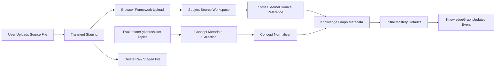

Rules:

- Source upload handoff is asynchronous.
- Raw staged files are deleted after handoff or expiry.
- Agent output must conform to `ConceptExtractionResult` when concepts are extracted from structured text.
- Extracted concepts begin with low confidence until confirmed by assessments, user interaction, or explicit user confirmation.
- Duplicate concepts are merged by canonical name, aliases, and embedding similarity.
- No local RAG corpus is built from uploaded lecture documents in MVP.

## 13. Event Architecture

### 13.1 Event Flow

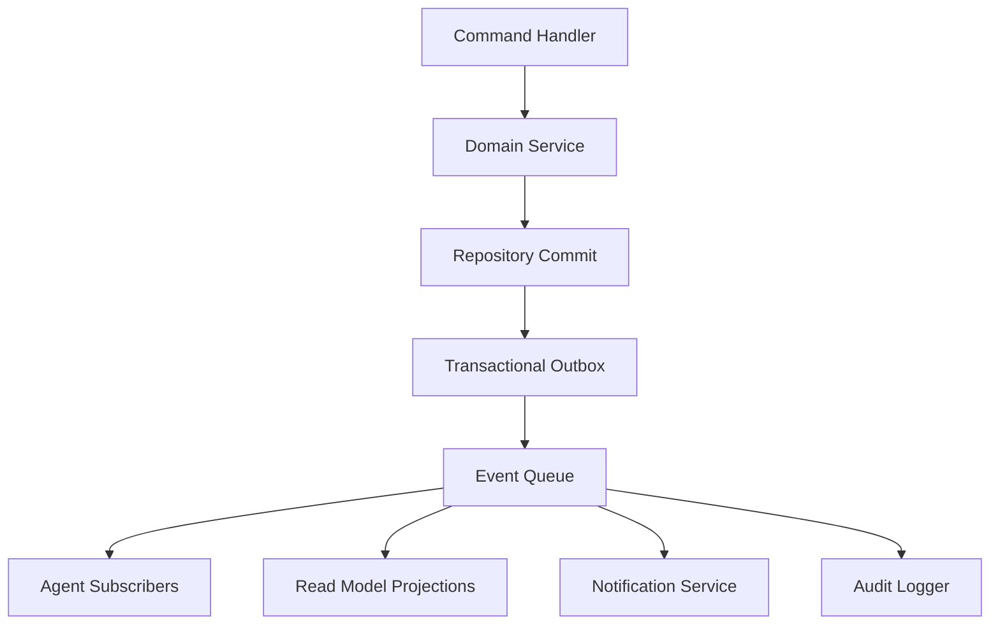

### 13.2 Event Rules

- Events are immutable.
- Events use `eventId`, `eventType`, `schemaVersion`, `occurredAt`, `actor`, `userId`, and `payload`.
- Event consumers must be idempotent.
- Event payloads contain IDs and summaries, not large documents.
- If event publication fails, the outbox retries.

### 13.3 Core Events

```json
{
  "eventId": "evt_01",
  "eventType": "DocumentHandoffRequested",
  "schemaVersion": "1.0",
  "occurredAt": "2026-07-22T00:00:00Z",
  "userId": "usr_01",
  "actor": { "type": "USER", "id": "usr_01" },
  "payload": {
    "documentHandoffId": "handoff_01",
    "subjectId": "sub_os",
    "documentType": "LECTURE_MATERIAL"
  }
}
```

Required events:

- `UserOnboarded`
- `SemesterOperationsStateCreated`
- `SemesterCreated`
- `SubjectCreated`
- `TimetableImported`
- `EvaluationPlanImported`
- `DocumentHandoffRequested`
- `DocumentHandoffCompleted`
- `SourceWorkspaceCreateRequested`
- `SourceWorkspaceCreated`
- `SourceWorkspaceUploadRequested`
- `SourceWorkspaceUploadCompleted`
- `KnowledgeGraphUpdated`
- `AssessmentRecorded`
- `MarksUpdated`
- `AttendanceRecorded`
- `RiskScoreUpdated`
- `PredictionUpdated`
- `StudyPlanGenerated`
- `CalendarEventCreated`
- `NotificationScheduled`
- `NotificationSent`
- `AgentRunStarted`
- `AgentRunCompleted`
- `AgentRunFailed`

## 14. Multi-Agent Architecture

### 14.1 Agent Communication Diagram

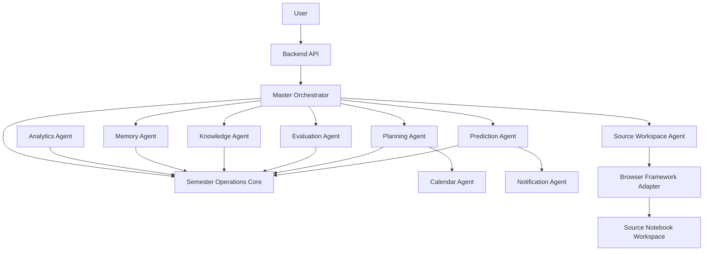

### 14.2 Agent Runtime Rules

- MVP agents are dedicated conversations in the user's connected AI chat workspace, driven through the Browser Automation Framework.
- Production agents may later become API-backed model workers, but the MVP must not require that.
- Agents receive typed inputs and return typed outputs.
- Agents do not decide authorization.
- Agents do not bypass command handlers for mutations.
- Agent prompts are versioned in `prompts/`.
- All agent outputs that affect state include confidence, evidence, and proposed actions.
- Master Orchestrator is the only agent allowed to coordinate multiple agents for a user request.
- Long-running agent tasks run through the queue.

### 14.3 How to Build Agents Using Separate Chat Conversations

The hackathon implementation should create agents as persistent browser-controlled chat conversations. Each agent is a normal chat in the connected AI chat account, initialized with a strict bootstrap prompt and then addressed by URL through the Browser Automation Framework.

This approach intentionally uses the chat product's own memory and conversation continuity. The app stores only agent registry metadata and run logs, not the chat provider's internal memory.

#### Agent Setup Procedure

1. Person 2 writes a bootstrap prompt for each agent in `prompts/{agentId}/system.md`.
2. Person 1 logs into the connected AI chat account in the persistent browser profile.
3. Person 1 or Person 2 creates one new chat per agent.
4. The bootstrap prompt is pasted into that chat.
5. The resulting chat URL is copied into `configs/agents.registry.json`.
6. Each agent is tested with one schema-conformance prompt.
7. The app uses the Browser Framework in target/open mode to navigate to the agent chat URL, send a task prompt, and collect the structured response.

#### Agent Registry

```json
{
  "agents": [
    {
      "agentId": "master-orchestrator",
      "displayName": "Master Orchestrator",
      "workspaceType": "CONNECTED_AI_CHAT",
      "chatUrl": "https://chat.example.com/c/master",
      "promptVersion": "1.0.0",
      "memoryMode": "PROVIDER_MEMORY_ENABLED",
      "capabilities": ["route_intent", "compose_response", "call_agent"],
      "outputSchema": "AgentRouteDecision"
    },
    {
      "agentId": "planning-agent",
      "displayName": "Planning Agent",
      "workspaceType": "CONNECTED_AI_CHAT",
      "chatUrl": "https://chat.example.com/c/planning",
      "promptVersion": "1.0.0",
      "memoryMode": "PROVIDER_MEMORY_ENABLED",
      "capabilities": ["generate_plan", "rebalance_schedule"],
      "outputSchema": "StudyPlan"
    }
  ]
}
```

#### Runtime Call Pattern

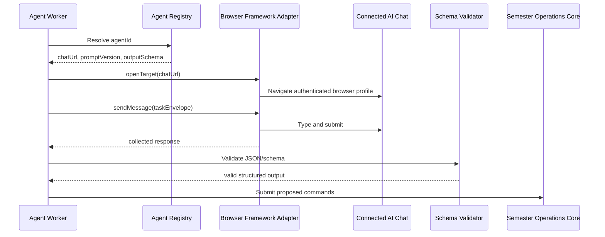

#### Task Envelope Sent to an Agent Chat

Every agent prompt sent through the browser framework must wrap runtime data in a machine-readable envelope:

```json
{
  "agentTask": {
    "runId": "run_01",
    "agentId": "planning-agent",
    "schemaVersion": "1.0",
    "instruction": "Generate a 7-day study plan.",
    "stateSummary": {
      "semesterId": "sem_01",
      "availableHours": 12,
      "upcomingAssessments": [],
      "riskSummary": []
    },
    "outputContract": {
      "format": "json",
      "schemaName": "StudyPlan"
    }
  }
}
```

#### Required Agent Response Format

```json
{
  "status": "SUCCEEDED",
  "confidence": 0.82,
  "evidence": [
    {
      "type": "STATE_REF",
      "id": "assessment_os_mse"
    }
  ],
  "output": {},
  "proposedCommands": [],
  "warnings": []
}
```

#### Failure Handling

- If the response is not valid JSON, retry once with a repair prompt in the same agent chat.
- If the second response is invalid, mark `AgentRunFailed`.
- If the browser profile is logged out, return `HUMAN_LOGIN_REQUIRED`.
- If a chat URL is missing, mark the agent as `NOT_CONFIGURED`.
- If the provider memory creates stale behavior, create a fresh chat and update `agents.registry.json`.

#### Agent Ownership

- Person 2 owns prompts, agent chats, and schema behavior.
- Person 1 owns the browser framework adapter and chat URL routing.
- Person 4 owns persistence of agent run metadata.
- Person 3 only consumes chat progress and results through backend APIs.

### 14.4 Agent Contracts

Base request:

```json
{
  "requestId": "req_01",
  "userId": "usr_01",
  "stateId": "state_01",
  "traceId": "trace_01",
  "idempotencyKey": "idem_01",
  "input": {},
  "contextRefs": []
}
```

Base response:

```json
{
  "requestId": "req_01",
  "status": "SUCCEEDED",
  "output": {},
  "confidence": 0.87,
  "evidence": [],
  "proposedCommands": [],
  "warnings": []
}
```

### 14.5 Agent Specifications

#### Initialization Agent

Owner: Person 2  
Purpose: conversational onboarding and first semester operations state construction.

Responsibilities:

- Ask for missing academic profile fields.
- Parse timetable/evaluation plan/document uploads with importer services.
- Create initial semester, subjects, timetable, goals, and preferences.
- Request Source Notebook Workspace creation through `SourceNotebookService`.
- Produce onboarding completion summary.

Memory:

- Short-term onboarding slots.
- Persistent onboarding state in `onboarding_sessions`.

Prompting strategy:

- Slot-filling prompt.
- Strict JSON output for missing fields and extracted entities.
- No freeform database writes.

Inputs:

- user messages.
- uploaded files.
- partial profile.

Outputs:

- `OnboardingPlan`
- `CreateStateCommand`
- `ImportTimetableCommand`
- `ImportEvaluationPlanCommand`
- `SourceWorkspaceCreateRequested`

API:

- `POST /api/v1/onboarding/sessions`
- `POST /api/v1/onboarding/sessions/{sessionId}/messages`
- `POST /api/v1/onboarding/sessions/{sessionId}/complete`

Failure modes:

- missing critical fields.
- unreadable document.
- contradictory subject data.
- Source Notebook Workspace creation failure.

Recovery:

- ask targeted clarification.
- create draft data with `needsReview=true`.
- retry Source Notebook Workspace task with same idempotency key.
- allow manual source workspace link.

#### Master Orchestrator

Owner: Person 1 and Person 2 jointly; Person 1 approves routing policies  
Purpose: classify user intent and coordinate agents.

Responsibilities:

- Intent classification.
- Agent routing.
- Context assembly from semester operations state.
- Tool call sequencing.
- Structured response formatting.
- Conversation state.

Memory:

- current conversation context.
- routing history.
- user preferences from semester operations state.

Prompting strategy:

- Router prompt with tool manifest.
- Must produce `AgentRouteDecision`.
- Refuses direct browser instructions from user.

Inputs:

- chat message.
- current state summary.
- available agent capabilities.

Outputs:

- direct answer.
- planned agent calls.
- proposed commands.

API:

- `POST /api/v1/chat/messages`
- internal `AgentRuntime.run(master, request)`

Failure modes:

- ambiguous intent.
- agent timeout.
- conflicting agent outputs.

Recovery:

- ask one concise clarification only when necessary.
- fallback to read-only answer.
- return partial result with next action.

#### Academic Reasoning Agent

Owner: Person 2  
Purpose: synthesize academic state across domains.

Responsibilities:

- Explain current academic situation.
- Compare workload, risk, goals, and performance.
- Produce evidence-backed insights.
- Generate daily and weekly briefings.

Memory:

- insight history.
- user explanation preferences.

Prompting strategy:

- Evidence-first reasoning.
- Must cite state object IDs in structured output.

Inputs:

- state summary.
- risk scores.
- calendar.
- assessments.
- knowledge state.

Outputs:

- `AcademicInsightSet`
- `Briefing`
- `RecommendationDraft`

Failure modes:

- stale data.
- missing evidence.
- hallucinated assessment.

Recovery:

- mark uncertainty.
- request state refresh.
- avoid claims without references.

#### Knowledge Agent

Owner: Person 2  
Purpose: build and maintain knowledge graph.

Responsibilities:

- Build concept metadata from syllabus/evaluation/user-entered topics and external workspace references.
- Link concepts to subjects, lectures, assessments, and external source references.
- Update mastery from assessments and chat interactions.
- Identify weak concepts and prerequisites.

Memory:

- vector memories.
- concept extraction cache.
- graph update history.

Prompting strategy:

- JSON schema constrained extraction.
- Canonical name normalization.
- Evidence references must use stored metadata, assessment records, or external workspace citations, not local document chunks.

Inputs:

- syllabus/evaluation/user-entered topic metadata.
- assessment results.
- user Q&A logs.
- subject metadata.

Outputs:

- `ConceptExtractionResult`
- `KnowledgeGraphPatch`
- `ConceptMasteryUpdate`

API:

- `POST /api/v1/knowledge/extract`
- `GET /api/v1/knowledge/graph`
- `GET /api/v1/knowledge/concepts/{conceptId}`
- `PATCH /api/v1/knowledge/mastery/{conceptId}`

Failure modes:

- noisy extraction.
- duplicate concepts.
- low-confidence concept extraction.

Recovery:

- merge duplicates.
- flag low confidence.
- let user confirm/rename concepts.

#### Planning Agent

Owner: Person 2  
Purpose: create and update study plans.

Responsibilities:

- Plan study sessions.
- Rebalance workload after new grades/deadlines.
- Create tasks and calendar events.
- Explain why a plan exists.

Memory:

- previous plans.
- user schedule preferences.
- completion history.

Prompting strategy:

- Constraint-aware planning.
- Inputs include available time, deadline urgency, risk, and knowledge gaps.
- Output only structured `StudyPlan`.

Inputs:

- calendar.
- timetable.
- assignments.
- assessments.
- goals.
- risk scores.
- mastery gaps.

Outputs:

- `StudyPlan`
- `CreateTaskCommand`
- `CreateCalendarEventCommand`

Failure modes:

- no available time.
- impossible goals.
- stale calendar.

Recovery:

- produce conflict report.
- ask user to choose trade-off.
- schedule minimum viable plan.

#### Evaluation Agent

Owner: Person 2  
Purpose: model evaluation plans, marks, and SGPA scenarios.

Responsibilities:

- Parse evaluation plans.
- Compute marks lost.
- Compute current score projections.
- Compute SGPA scenarios.
- Identify assessments that matter most.

Memory:

- grading scheme assumptions.
- prior scenario results.

Prompting strategy:

- Prefer deterministic calculations outside LLM.
- LLM only extracts/normalizes messy uploaded plans.

Inputs:

- evaluation plan files.
- marks.
- credits.
- target SGPA.

Outputs:

- `EvaluationPlanPatch`
- `GradeScenario`
- `MarksRiskReport`

Failure modes:

- ambiguous grading scheme.
- missing assessment weights.
- conflicting marks.

Recovery:

- mark fields as `needsReview`.
- request confirmation.
- use conservative defaults with warning.

#### Prediction Agent

Owner: Person 2  
Purpose: forecast grades, risk, workload, and deadline outcomes.

Responsibilities:

- Predict subject grade.
- Predict SGPA.
- Predict deadline risk.
- Predict attendance risk.
- Produce risk driver explanations.

Memory:

- model features and predictions.
- calibration metrics.

Prompting strategy:

- Deterministic/ML calculation first.
- LLM only explains predictions in user language.

Inputs:

- marks.
- attendance.
- study history.
- mastery.
- deadlines.
- goals.

Outputs:

- `RiskScore`
- `Prediction`
- `PredictionExplanation`

Failure modes:

- insufficient data.
- overconfident prediction.
- model drift.

Recovery:

- return broad confidence intervals.
- label as heuristic.
- request more data.

#### Notification Agent

Owner: Person 4 with Person 2 for content strategy  
Purpose: schedule and deliver reminders.

Responsibilities:

- Listen to deadline/risk events.
- Create notification plans.
- Dedupe notifications.
- Send push/email/in-app notifications.

Memory:

- notification preferences.
- notification history.

Prompting strategy:

- Template-based messages.
- LLM only for summary text if enabled.

Inputs:

- risk events.
- calendar events.
- user preferences.

Outputs:

- `NotificationScheduled`
- `NotificationSent`

Failure modes:

- permission denied.
- provider failure.
- duplicate reminders.

Recovery:

- fallback to in-app notification.
- retry with exponential backoff.
- dedupe by key.

#### Memory Agent

Owner: Person 2  
Purpose: manage persistent memory for user preferences, study style, and important facts.

Responsibilities:

- Extract durable preferences from interactions.
- Save study history summaries.
- Expire stale memories.
- Provide relevant context to other agents.

Memory:

- `AgentMemory`.
- vector embeddings.
- preference store.

Prompting strategy:

- Memory write filter: only stable, useful, consent-safe facts.
- Avoid storing secrets or sensitive raw content.

Inputs:

- chat interactions.
- completed tasks.
- user corrections.

Outputs:

- `MemoryWriteCommand`
- `MemoryRetrievalResult`

Failure modes:

- storing ephemeral facts.
- privacy issue.
- conflicting memories.

Recovery:

- require confidence threshold.
- allow user deletion.
- retain conflict metadata.

#### Source Workspace Agent

Owner: Person 2 for agent wrapper, Person 1 for BrowserFrameworkAdapter contract  
Purpose: delegate source-grounded Q&A and source workspace operations.

Responsibilities:

- Decide when Source Notebook Workspace is appropriate.
- Call `SourceNotebookService`.
- Track source status.
- Return source workspace answer and citations when available.

Memory:

- workspace mapping by subject.
- prior query metadata.

Prompting strategy:

- Minimal prompt shaping.
- Do not claim Source Notebook Workspace output as native model knowledge.

Inputs:

- subject-scoped query.
- workspace ID.
- external source references.

Outputs:

- `SourceWorkspaceQueryResult`
- `SourceWorkspaceOperationStatus`

Failure modes:

- source workspace unavailable.
- upload incomplete.
- BrowserFrameworkAdapter timeout.
- external UI changed.

Recovery:

- retry with idempotency key.
- fallback to a manual source workspace link or ask the user to retry connection.
- return degraded answer with clear source limitations.

#### Calendar Agent

Owner: Person 4  
Purpose: maintain calendar state and optional external calendar sync.

Responsibilities:

- Create internal events.
- Map timetable recurrence.
- Sync external calendar if connected.
- Resolve conflicts.

Memory:

- calendar provider sync cursor.
- conflict history.

Prompting strategy:

- Mostly deterministic.
- LLM may summarize conflicts.

Inputs:

- timetable.
- study plans.
- user preferences.

Outputs:

- `CalendarEvent`
- `CalendarConflictReport`

Failure modes:

- provider unavailable.
- recurrence mismatch.
- timezone error.

Recovery:

- store internal event.
- retry sync.
- surface conflict.

#### Analytics Agent

Owner: Person 2  
Purpose: summarize trends and dashboard analytics.

Responsibilities:

- Generate weekly review.
- Track adherence.
- Explain performance trends.
- Prepare visualization-ready analytics.

Memory:

- weekly summaries.
- metric history.

Prompting strategy:

- Numeric metrics from deterministic queries.
- LLM summaries grounded in metrics.

Inputs:

- tasks.
- marks.
- attendance.
- risk history.
- study sessions.

Outputs:

- `AnalyticsSummary`
- `TrendCard`
- `WeeklyReview`

Failure modes:

- missing data.
- misleading trend from small sample.

Recovery:

- label low data confidence.
- show raw values.

## 15. Browser Automation Boundary

### 15.1 Binding Rule

Browser Automation is not part of Semester Operations business logic. It is a local framework created by Person 2, built around Playwright, persistent browser profiles, optional `cookies.json` import, site adapter JSON, and response-stability collection.

It is not assumed to be a hosted REST API. For MVP, the backend/worker calls it through a thin adapter that wraps the existing framework. The adapter may call Python directly, spawn a subprocess, or call a local wrapper process. The rest of the product must not care.

Allowed dependency:

```text
Semester Operations -> SourceNotebookService / ConnectedChatService -> BrowserFrameworkAdapter -> Browser Automation Framework
```

Forbidden dependencies:

```text
frontend -> BrowserFrameworkAdapter
agents -> browser DOM
backend domain -> Playwright
SourceNotebookService -> browser internals
ConnectedChatService -> browser internals
```

### 15.2 Existing Framework Facts

The current Browser Automation Framework contains:

- `poc.py`: Playwright sync proof of concept.
- `site_adapter.json`: current connected chat site adapter.
- `profiles/{session_id}`: persistent browser profile directories.
- `cookies.json` support: optional cookie import before navigation.
- headful mode by default, with optional hidden/off-screen mode.
- target mode: open a specific chat URL.
- new chat mode: create a new chat.
- open mode: scrape recent chats from sidebar.
- response collector: waits for generation indicator disappearance and stable response text.

The product must wrap these capabilities rather than rewriting them.

### 15.3 MVP Adapter Implementation

Decision: implement `BrowserFrameworkAdapter` as a Python wrapper module plus a backend worker facade.

Implementation shape:

```text
backend/worker job
  -> services/browser/BrowserFrameworkAdapter.ts
  -> browser/runner/browser_framework_cli.py
  -> existing Browser API framework functions
  -> persistent browser profile
```

Person 1 should refactor `poc.py` into importable functions without changing its core behavior:

```text
browser/
  framework/
    browser_session.py
    adapter_loader.py
    chat_runtime.py
    response_collector.py
    source_workspace_runtime.py
  runner/
    browser_framework_cli.py
  adapters/
    connected_chat.adapter.json
    source_workspace.adapter.json
```

The CLI must accept JSON input and return JSON output so Node/TypeScript workers can call it safely.

### 15.4 BrowserFrameworkAdapter Interface

Interface owner: Person 1 only.

```ts
interface BrowserFrameworkAdapter {
  initializeSession(request: InitializeBrowserSessionRequest): Promise<BrowserSessionStatus>;
  importCookies(request: ImportCookiesRequest): Promise<BrowserSessionStatus>;
  openTarget(request: OpenTargetRequest): Promise<BrowserOperationResult>;
  createChat(request: CreateChatRequest): Promise<CreateChatResponse>;
  sendChatMessage(request: SendChatMessageRequest): Promise<ChatMessageResult>;
  listRecentChats(request: ListRecentChatsRequest): Promise<ListRecentChatsResponse>;
  createSourceWorkspace(request: CreateSourceWorkspaceRequest): Promise<SourceWorkspaceOperationResult>;
  uploadSourceToWorkspace(request: UploadSourceToWorkspaceRequest): Promise<SourceWorkspaceOperationResult>;
  querySourceWorkspace(request: QuerySourceWorkspaceRequest): Promise<SourceWorkspaceQueryResult>;
  getSessionStatus(request: GetBrowserSessionStatusRequest): Promise<BrowserSessionStatus>;
}
```

### 15.5 Browser Framework DTOs

`InitializeBrowserSessionRequest`

```json
{
  "userId": "usr_01",
  "sessionId": "usr_01_default",
  "profileDir": "Browser API/profiles/usr_01_default",
  "siteAdapterId": "connected_chat",
  "headless": false,
  "hideWindow": false
}
```

`ImportCookiesRequest`

```json
{
  "userId": "usr_01",
  "sessionId": "usr_01_default",
  "provider": "CONNECTED_AI_CHAT",
  "cookiesJsonPath": "secure-local-path/cookies.json"
}
```

Rules:

- `cookiesJsonPath` must point to local user-provided export.
- cookies are loaded into the persistent browser context.
- cookies are never committed to Git.
- imported cookies are treated as secrets.

`OpenTargetRequest`

```json
{
  "userId": "usr_01",
  "sessionId": "usr_01_default",
  "targetUrl": "https://chat.example.com/c/planning-agent",
  "siteAdapterId": "connected_chat"
}
```

`SendChatMessageRequest`

```json
{
  "userId": "usr_01",
  "sessionId": "usr_01_default",
  "targetUrl": "https://chat.example.com/c/planning-agent",
  "message": "{\"agentTask\":{\"runId\":\"run_01\"}}",
  "siteAdapterId": "connected_chat",
  "timeoutMs": 90000,
  "idempotencyKey": "agent_run_01"
}
```

`ChatMessageResult`

```json
{
  "operationId": "op_02",
  "status": "SUCCEEDED",
  "responseText": "{\"status\":\"SUCCEEDED\",\"output\":{}}",
  "rawText": "optional raw collected text",
  "targetUrl": "https://chat.example.com/c/planning-agent"
}
```

`UploadSourceToWorkspaceRequest`

```json
{
  "userId": "usr_01",
  "sessionId": "usr_01_source_workspace",
  "workspaceUrl": "https://source-workspace.example.com/source workspace/os",
  "localFilePath": "tmp/uploads/handoff_01/os_lecture_1.pdf",
  "subjectId": "sub_os",
  "idempotencyKey": "handoff_01_upload"
}
```

Rules:

- `localFilePath` is transient.
- after upload success, cleanup job deletes the file.
- adapter returns external source metadata only.

`BrowserSessionStatus`

```json
{
  "userId": "usr_01",
  "sessionId": "usr_01_default",
  "state": "READY",
  "lastOperationId": "op_02",
  "requiresHumanAction": false,
  "message": null
}
```

Status enum:

- `UNINITIALIZED`
- `AWAITING_LOGIN`
- `READY`
- `BUSY`
- `ERROR`
- `EXPIRED`

Error codes:

- `BROWSER_SESSION_EXPIRED`
- `BROWSER_OPERATION_TIMEOUT`
- `SOURCE_WORKSPACE_NOT_FOUND`
- `SOURCE_UPLOAD_FAILED`
- `HUMAN_LOGIN_REQUIRED`
- `EXTERNAL_SITE_CHANGED`
- `COOKIES_IMPORT_FAILED`
- `AGENT_CHAT_NOT_CONFIGURED`
- `UNKNOWN_BROWSER_FRAMEWORK_ERROR`

### 15.6 Account Connection Model

The system supports three connection paths.

#### Path A: Persistent Profile Login

Recommended MVP path.

1. User clicks "Connect AI Workspace" or "Connect Source Workspace."
2. Backend creates a browser session profile directory for that provider and user.
3. Browser Framework opens the real provider login page in headful mode.
4. User logs in manually and solves any verification challenge.
5. Framework detects the logged-in state or user confirms readiness.
6. Product stores only provider connection metadata and profile ID.

Pros:

- lowest implementation risk.
- aligns with current framework.
- avoids credential handling.

Cons:

- requires a visible browser once per account/profile.

#### Path B: Cookies JSON Import

Supported for power users and hackathon speed.

1. User exports cookies from their own browser for the target provider.
2. User uploads/selects `cookies.json` locally.
3. Framework imports cookies into the persistent profile.
4. Browser navigates to provider and verifies session.
5. The app deletes the uploaded cookie file from staging.

Rules:

- cookie import is local-only.
- cookie file must never be stored in database or Git.
- show warning that cookies grant account access.
- failed import falls back to manual login.

#### Path C: OAuth

Use OAuth only for providers that expose official APIs for the required action.

For the connected chat and source workspace browser flows, OAuth is not sufficient by itself because the framework drives a browser UI. OAuth may be useful for calendar, drive, email, or future official provider APIs. It should not be used as a fake replacement for browser session state.

### 15.7 Connected Chat Memory Strategy

The MVP deliberately uses provider-side chat memory and persistent conversation context.

Rules:

- one dedicated chat URL per agent.
- agent chat URLs are stored in `configs/agents.registry.json`.
- provider memory is allowed for agents where helpful.
- app stores agent run metadata, not provider memory internals.
- if provider memory causes stale behavior, create a fresh chat and update registry.
- prompts must remind the chat agent to obey current `stateSummary` over older memory.

## 16. API Design Standards

### 16.1 REST Rules

- All public endpoints use `/api/v1`.
- JSON only for request/response except file upload.
- All write endpoints accept `Idempotency-Key` header.
- All responses include `requestId`.
- All validation errors use a common error envelope.
- All datetime values are ISO 8601 UTC.
- All IDs are opaque strings.
- Authentication uses bearer JWT for MVP.
- Authorization is user-scoped by default.

### 16.2 Error Envelope

```json
{
  "requestId": "req_01",
  "error": {
    "code": "VALIDATION_ERROR",
    "message": "One or more fields are invalid.",
    "details": [
      {
        "field": "subjectId",
        "reason": "Required"
      }
    ]
  }
}
```

Common errors:

- `UNAUTHENTICATED`
- `FORBIDDEN`
- `NOT_FOUND`
- `VALIDATION_ERROR`
- `CONFLICT`
- `IDEMPOTENCY_CONFLICT`
- `RATE_LIMITED`
- `AGENT_TIMEOUT`
- `EXTERNAL_SERVICE_UNAVAILABLE`
- `INTERNAL_ERROR`

### 16.3 Authorization Model

Roles:

- `student`: can access own data.
- `admin`: operational support, no raw document access unless explicitly granted.
- `service`: internal service token.

Rules:

- A student can only read/write resources scoped to their `userId`.
- Agents operate under service identity plus target `userId`.
- BrowserFrameworkAdapter calls require service token and user-scoped operation ID.
- Prompt history does not expose raw prompts to frontend unless admin/debug mode is enabled.

## 17. API Endpoints

Each endpoint below is required for implementation unless marked future.

### 17.1 Auth

#### `POST /api/v1/auth/register`

Purpose: create user account.  
Input:

```json
{
  "email": "student@example.com",
  "password": "string",
  "displayName": "Ishaan"
}
```

Output:

```json
{
  "requestId": "req_01",
  "userId": "usr_01",
  "accessToken": "jwt",
  "refreshToken": "token"
}
```

Errors: `VALIDATION_ERROR`, `CONFLICT`.  
Authentication: none.  
Authorization: public.  
Idempotency: by email uniqueness.  
Validation: valid email, password policy, displayName 1 to 120 chars.

#### `POST /api/v1/auth/login`

Purpose: authenticate user.  
Input: email and password.  
Output: access and refresh tokens.  
Errors: `UNAUTHENTICATED`.  
Authentication: none.  
Authorization: public.  
Idempotency: not required.

#### `POST /api/v1/auth/refresh`

Purpose: refresh access token.  
Input: refresh token.  
Output: access token.  
Errors: `UNAUTHENTICATED`.  
Authentication: refresh token.  
Authorization: owner.

### 17.2 Onboarding

#### `POST /api/v1/onboarding/sessions`

Purpose: start conversational onboarding.  
Input:

```json
{
  "timezone": "Asia/Kolkata",
  "initialGoal": "Build my Semester 3 operations command center"
}
```

Output:

```json
{
  "requestId": "req_01",
  "sessionId": "onb_01",
  "status": "IN_PROGRESS",
  "nextPrompt": "Tell me your degree, semester, and subjects."
}
```

Errors: `UNAUTHENTICATED`, `VALIDATION_ERROR`.  
Authentication: required.  
Authorization: owner.  
Idempotency: `Idempotency-Key` recommended.  
Validation: timezone required.

#### `POST /api/v1/onboarding/sessions/{sessionId}/messages`

Purpose: continue onboarding chat.  
Input:

```json
{
  "message": "I am in B.Tech AIML, Semester 3.",
  "attachments": ["doc_01"]
}
```

Output:

```json
{
  "requestId": "req_02",
  "sessionId": "onb_01",
  "status": "IN_PROGRESS",
  "capturedFields": {
    "degree": "B.Tech",
    "program": "AIML",
    "semesterNumber": 3
  },
  "missingFields": ["subjects"],
  "nextPrompt": "Upload or enter your subject list."
}
```

Errors: `NOT_FOUND`, `AGENT_TIMEOUT`, `VALIDATION_ERROR`.  
Authentication: required.  
Authorization: owner.  
Idempotency: required for messages with attachments.

#### `POST /api/v1/onboarding/sessions/{sessionId}/complete`

Purpose: create semester operations state and initial domain records from onboarding state.  
Input:

```json
{
  "confirmed": true
}
```

Output:

```json
{
  "requestId": "req_03",
  "stateId": "twin_01",
  "status": "CREATED",
  "pendingOperations": [
    {
      "type": "CREATE_SOURCE_WORKSPACES",
      "operationGroupId": "grp_01"
    }
  ]
}
```

Errors: `CONFLICT`, `VALIDATION_ERROR`.  
Authentication: required.  
Authorization: owner.  
Idempotency: required.

### 17.3 Semester Operations State

#### `GET /api/v1/state`

Purpose: fetch current semester operations state summary.  
Output:

```json
{
  "requestId": "req_01",
  "state": {
    "stateId": "state_01",
    "version": 12,
    "activeSemesterId": "sem_01",
    "summary": {
      "todayScheduleCount": 5,
      "riskLevel": "MEDIUM",
      "openAssignments": 3
    }
  }
}
```

Errors: `NOT_FOUND`.  
Authentication: required.  
Authorization: owner.  
Idempotency: read-only.

#### `GET /api/v1/state/detail`

Purpose: fetch full structured academic state for dashboard.  
Output: `AcademicStateResponse`.  
Authentication: required.  
Authorization: owner.

#### `POST /api/v1/state/recompute`

Purpose: recompute projections, risk, and dashboard state.  
Input:

```json
{
  "reason": "USER_REQUEST"
}
```

Output:

```json
{
  "requestId": "req_01",
  "jobId": "job_01",
  "status": "QUEUED"
}
```

Errors: `RATE_LIMITED`, `CONFLICT`.  
Authentication: required.  
Authorization: owner.  
Idempotency: required.

### 17.4 Semesters and Subjects

#### `POST /api/v1/semesters`

Purpose: create semester.  
Input: `CreateSemesterRequest`.  
Output: `SemesterResponse`.  
Validation: name, number, dates, targetSgpa optional numeric.

#### `GET /api/v1/semesters`

Purpose: list semesters.  
Output: list of semesters.

#### `GET /api/v1/semesters/{semesterId}`

Purpose: get semester detail.  
Output: semester with subjects summary.

#### `PATCH /api/v1/semesters/{semesterId}`

Purpose: update semester metadata.  
Input: partial fields.  
Idempotency: required.

#### `POST /api/v1/semesters/{semesterId}/subjects`

Purpose: create subject.  
Input:

```json
{
  "code": "OS",
  "name": "Operating Systems",
  "credits": 4,
  "subjectType": "THEORY_LAB",
  "faculty": ["SVB", "DKB"]
}
```

Output: `SubjectResponse`.  
Errors: `CONFLICT` on duplicate code.

#### `GET /api/v1/subjects/{subjectId}`

Purpose: subject detail including source workspace, risk, next events, and evaluation summary.

#### `PATCH /api/v1/subjects/{subjectId}`

Purpose: update subject metadata.  
Authorization: owner.  
Idempotency: required.

### 17.5 Timetable and Calendar

#### `POST /api/v1/timetable/import`

Purpose: import weekly timetable from structured JSON or parsed document.  
Input:

```json
{
  "semesterId": "sem_01",
  "source": "MANUAL_JSON",
  "entries": [
    {
      "dayOfWeek": "MONDAY",
      "startTime": "09:00",
      "endTime": "09:55",
      "subjectCode": "SML",
      "type": "THEORY",
      "faculty": "SUK",
      "room": "503"
    }
  ]
}
```

Output:

```json
{
  "requestId": "req_01",
  "createdEvents": 32,
  "needsReview": []
}
```

Errors: `VALIDATION_ERROR`, `NOT_FOUND`.  
Authentication: required.  
Authorization: owner.  
Idempotency: required.

#### `GET /api/v1/calendar/events`

Purpose: list calendar events.  
Query params: `from`, `to`, `eventType`, `subjectId`.  
Output: `CalendarEvent[]`.  
Validation: date range max 180 days for MVP.

#### `POST /api/v1/calendar/events`

Purpose: create calendar event.  
Input: `CreateCalendarEventRequest`.  
Output: `CalendarEventResponse`.  
Idempotency: required.

#### `PATCH /api/v1/calendar/events/{eventId}`

Purpose: update calendar event.  
Input: partial fields.  
Idempotency: required.

#### `DELETE /api/v1/calendar/events/{eventId}`

Purpose: cancel/delete event.  
Output: deleted status.  
Idempotency: required.

### 17.6 Document Handoffs

#### `POST /api/v1/document-handoffs`

Purpose: upload a file into transient staging so the Browser Automation Framework can hand it off to the required subject source workspace. The platform records metadata and deletes the raw file after handoff or expiry.

Input: multipart form:

- `file`
- `semesterId`
- `subjectId`
- `documentType`

Output:

```json
{
  "requestId": "req_01",
  "documentHandoffId": "handoff_01",
  "handoffStatus": "QUEUED",
  "stagingExpiresAt": "2026-07-22T12:00:00Z"
}
```

Errors: `VALIDATION_ERROR`, `RATE_LIMITED`.  
Authentication: required.  
Authorization: owner.  
Idempotency: checksum plus header key.

Validation:

- accepted types: PDF, DOCX, TXT, MD, PPTX where parser supports.
- max file size configurable; MVP default 25 MB.
- subject must belong to user.
- raw file retention max: 24 hours for MVP, shorter in production where possible.

#### `GET /api/v1/document-handoffs`

Purpose: list document handoff metadata and processing status.  
Query params: `subjectId`, `documentType`, `status`.  
Output: document handoff list.

#### `GET /api/v1/document-handoffs/{documentHandoffId}`

Purpose: document handoff metadata and processing status.

#### `DELETE /api/v1/document-handoffs/{documentHandoffId}`

Purpose: delete transient staged file if still present and remove handoff metadata where allowed.  
Idempotency: required.

#### `POST /api/v1/document-handoffs/{documentHandoffId}/retry`

Purpose: retry handoff to the source workspace.  
Output: queued job.

### 17.7 Source Workspaces

#### `POST /api/v1/source-workspaces`

Purpose: create external source notebook workspace for subject through `BrowserFrameworkAdapter`.  
Input:

```json
{
  "subjectId": "sub_os",
  "title": "Operating Systems"
}
```

Output:

```json
{
  "requestId": "req_01",
  "sourceWorkspaceId": "sw_01",
  "operationId": "op_01",
  "status": "CREATING"
}
```

Errors: `EXTERNAL_SERVICE_UNAVAILABLE`, `BROWSER_SESSION_EXPIRED`, `CONFLICT`.  
Authentication: required.  
Authorization: owner.  
Idempotency: required.

#### `POST /api/v1/source-workspaces/{sourceWorkspaceId}/sources`

Purpose: upload a transient handoff file into source workspace.  
Input:

```json
{
  "documentHandoffId": "handoff_01"
}
```

Output: operation status.  
Idempotency: required.

#### `POST /api/v1/source-workspaces/{sourceWorkspaceId}/query`

Purpose: query external source workspace worker.  
Input:

```json
{
  "question": "Explain semaphores from my OS notes.",
  "includeCitations": true
}
```

Output:

```json
{
  "requestId": "req_01",
  "answer": "string",
  "citations": [],
  "source": "SOURCE_WORKSPACE",
  "confidence": 0.8
}
```

Errors: `SOURCE_WORKSPACE_NOT_FOUND`, `AGENT_TIMEOUT`, `EXTERNAL_SERVICE_UNAVAILABLE`.  
Authentication: required.  
Authorization: owner.  
Idempotency: optional for read-like query; required if query is logged as task.

#### `GET /api/v1/source-workspaces`

Purpose: list source workspaces.

#### `GET /api/v1/source-workspaces/{sourceWorkspaceId}/status`

Purpose: get source workspace sync/source status.

### 17.8 Evaluation and Marks

#### `POST /api/v1/evaluation-plans/import`

Purpose: import evaluation plan from document or structured data.  
Input:

```json
{
  "semesterId": "sem_01",
  "documentId": "doc_eval_01",
  "mode": "PARSE_DOCUMENT"
}
```

Output:

```json
{
  "requestId": "req_01",
  "jobId": "job_eval_01",
  "status": "QUEUED"
}
```

Errors: `VALIDATION_ERROR`, `NOT_FOUND`.  
Authentication: required.  
Authorization: owner.  
Idempotency: required.

#### `POST /api/v1/subjects/{subjectId}/evaluation-plan`

Purpose: create evaluation plan manually.  
Input: `EvaluationPlanRequest`.  
Output: `EvaluationPlanResponse`.

#### `GET /api/v1/subjects/{subjectId}/evaluation-plan`

Purpose: fetch evaluation plan.

#### `POST /api/v1/assessments`

Purpose: create assessment.  
Input:

```json
{
  "subjectId": "sub_os",
  "name": "MSE",
  "type": "MID_SEM",
  "category": "CA",
  "marksMax": 20,
  "scheduledAt": "2026-09-10T09:00:00Z"
}
```

Output: `AssessmentResponse`.

#### `PATCH /api/v1/assessments/{assessmentId}/marks`

Purpose: record/update marks.  
Input:

```json
{
  "marksObtained": 14.5,
  "maxScore": 20,
  "verified": false
}
```

Output:

```json
{
  "requestId": "req_01",
  "assessmentId": "asm_01",
  "marksLost": 5.5,
  "riskRecomputeQueued": true
}
```

Errors: `VALIDATION_ERROR`, `NOT_FOUND`.  
Authentication: required.  
Authorization: owner.  
Idempotency: required.

#### `GET /api/v1/grades/sgpa-scenarios`

Purpose: compute SGPA scenarios.  
Query params: `semesterId`, optional target overrides.  
Output: `SgpaScenarioResponse`.

### 17.9 Attendance

#### `POST /api/v1/attendance`

Purpose: record attendance.  
Input:

```json
{
  "lectureId": "lec_01",
  "status": "PRESENT",
  "source": "MANUAL"
}
```

Output: `AttendanceRecordResponse`.  
Idempotency: required.

#### `GET /api/v1/attendance/summary`

Purpose: attendance summary by subject and semester.  
Query params: `semesterId`.

### 17.10 Knowledge

#### `GET /api/v1/knowledge/graph`

Purpose: fetch graph projection for visualization.  
Query params: `semesterId`, `subjectId`, `depth`, `includeMastery`.  
Output: nodes and edges.

#### `GET /api/v1/knowledge/concepts`

Purpose: list concepts.  
Query params: `subjectId`, `masteryBelow`, `q`.

#### `GET /api/v1/knowledge/concepts/{conceptId}`

Purpose: concept detail with sources, mastery, relationships, and related assessments.

#### `PATCH /api/v1/knowledge/concepts/{conceptId}/mastery`

Purpose: manual or agent-approved mastery update.  
Input:

```json
{
  "masteryProbability": 0.72,
  "confidence": 0.8,
  "evidence": "Manual self-assessment after practice."
}
```

Authorization: owner.  
Idempotency: required.

### 17.11 Planning

#### `POST /api/v1/plans/generate`

Purpose: generate study plan.  
Input:

```json
{
  "semesterId": "sem_01",
  "horizonDays": 7,
  "goalIds": ["goal_sgpa"],
  "constraints": {
    "maxStudyHoursPerDay": 3,
    "avoidTimes": []
  }
}
```

Output:

```json
{
  "requestId": "req_01",
  "planId": "plan_01",
  "status": "GENERATED",
  "tasksCreated": 8,
  "calendarEventsCreated": 5
}
```

Errors: `AGENT_TIMEOUT`, `VALIDATION_ERROR`.  
Authentication: required.  
Authorization: owner.  
Idempotency: required.

#### `GET /api/v1/plans/current`

Purpose: fetch current active plan.

#### `PATCH /api/v1/plans/{planId}/tasks/{taskId}`

Purpose: update task status or schedule.

### 17.12 Goals

#### `POST /api/v1/goals`

Purpose: create academic goal.  
Input:

```json
{
  "semesterId": "sem_01",
  "title": "Reach 8.25 SGPA",
  "goalType": "SGPA",
  "targetMetric": "SGPA",
  "targetValue": 8.25,
  "deadline": "2026-12-31"
}
```

Output: `GoalResponse`.

#### `GET /api/v1/goals`

Purpose: list goals.

#### `PATCH /api/v1/goals/{goalId}`

Purpose: update goal.

### 17.13 Risk and Prediction

#### `GET /api/v1/risk`

Purpose: current risk summary.  
Query params: `semesterId`, optional `subjectId`.  
Output: risk scores and drivers.

#### `POST /api/v1/risk/recompute`

Purpose: recompute risk.  
Output: queued job.  
Idempotency: required.

#### `GET /api/v1/predictions`

Purpose: list latest predictions.  
Query params: `semesterId`, `subjectId`, `predictionType`.

#### `POST /api/v1/predictions/scenarios`

Purpose: run what-if prediction.  
Input:

```json
{
  "semesterId": "sem_01",
  "assumptions": [
    {
      "assessmentId": "asm_final_os",
      "score": 42
    }
  ]
}
```

Output: `PredictionScenarioResponse`.  
Idempotency: optional.

### 17.14 Chat

#### `POST /api/v1/chat/conversations`

Purpose: create chat conversation.  
Input:

```json
{
  "title": "OS revision planning",
  "scope": {
    "semesterId": "sem_01",
    "subjectId": "sub_os"
  }
}
```

Output: `ConversationResponse`.

#### `POST /api/v1/chat/conversations/{conversationId}/messages`

Purpose: send user message to Master Orchestrator.  
Input:

```json
{
  "message": "What should I study today?",
  "mode": "AUTO",
  "attachments": []
}
```

Output:

```json
{
  "requestId": "req_01",
  "messageId": "msg_01",
  "status": "PROCESSING",
  "streamUrl": "/api/v1/chat/conversations/conv_01/stream"
}
```

Errors: `AGENT_TIMEOUT`, `VALIDATION_ERROR`, `RATE_LIMITED`.  
Authentication: required.  
Authorization: owner.  
Idempotency: required.

#### `GET /api/v1/chat/conversations/{conversationId}/messages`

Purpose: list conversation messages.

#### `GET /api/v1/chat/conversations/{conversationId}/stream`

Purpose: server-sent events for message progress.  
Authentication: required.  
Authorization: owner.

### 17.15 Notifications

#### `GET /api/v1/notifications`

Purpose: list notifications.  
Query params: `status`, `from`, `to`.

#### `PATCH /api/v1/notifications/{notificationId}`

Purpose: mark read, snooze, dismiss, or complete action.

#### `POST /api/v1/notifications/test`

Purpose: test notification delivery.  
Authorization: owner.  
Idempotency: required.

### 17.16 Audit and Agent Operations

#### `GET /api/v1/audit-logs`

Purpose: user-visible audit history.  
Query params: `resourceType`, `from`, `to`.  
Authorization: owner.  
Raw sensitive details redacted.

#### `GET /api/v1/agent-runs`

Purpose: list agent runs for debugging.  
Authorization: owner for own runs, admin for all.

#### `GET /api/v1/agent-runs/{runId}`

Purpose: inspect agent run metadata.  
Prompt contents may be redacted.

### 17.17 API Contract Matrix

This matrix is binding for endpoints that were described in prose above. `Auth` means bearer JWT required. `Owner` means resource `userId` must match authenticated user unless a service/admin override is explicitly documented.

| Method | Path | Input Model | Output Model | Primary Errors | Auth | Idempotency | Validation |
|---|---|---|---|---|---|---|---|
| POST | `/auth/register` | `RegisterRequest` | `AuthTokenResponse` | `VALIDATION_ERROR`, `CONFLICT` | Public | Email uniqueness | email valid, password policy |
| POST | `/auth/login` | `LoginRequest` | `AuthTokenResponse` | `UNAUTHENTICATED` | Public | No | email/password required |
| POST | `/auth/refresh` | `RefreshRequest` | `AuthTokenResponse` | `UNAUTHENTICATED` | Refresh token | No | refresh token active |
| POST | `/onboarding/sessions` | `CreateOnboardingSessionRequest` | `OnboardingSessionResponse` | `VALIDATION_ERROR` | Auth/Owner | Required | timezone valid |
| POST | `/onboarding/sessions/{sessionId}/messages` | `OnboardingMessageRequest` | `OnboardingMessageResponse` | `NOT_FOUND`, `AGENT_TIMEOUT`, `VALIDATION_ERROR` | Auth/Owner | Required when attachments exist | message non-empty or attachments present |
| POST | `/onboarding/sessions/{sessionId}/complete` | `CompleteOnboardingRequest` | `CompleteOnboardingResponse` | `CONFLICT`, `VALIDATION_ERROR` | Auth/Owner | Required | required slots complete or `needsReview` accepted |
| GET | `/state` | none | `SemesterOperationsStateResponse` | `NOT_FOUND` | Auth/Owner | Read-only | active user has state |
| GET | `/state/detail` | none | `AcademicStateResponse` | `NOT_FOUND` | Auth/Owner | Read-only | active user has state |
| POST | `/state/recompute` | `RecomputeStateRequest` | `JobResponse` | `RATE_LIMITED`, `CONFLICT` | Auth/Owner | Required | reason enum |
| POST | `/semesters` | `CreateSemesterRequest` | `SemesterResponse` | `VALIDATION_ERROR`, `CONFLICT` | Auth/Owner | Required | semester number unique per user |
| GET | `/semesters` | query | `SemesterListResponse` | `VALIDATION_ERROR` | Auth/Owner | Read-only | query range valid |
| GET | `/semesters/{semesterId}` | path | `SemesterResponse` | `NOT_FOUND` | Auth/Owner | Read-only | owns semester |
| PATCH | `/semesters/{semesterId}` | `UpdateSemesterRequest` | `SemesterResponse` | `NOT_FOUND`, `VALIDATION_ERROR` | Auth/Owner | Required | dates and SGPA valid |
| POST | `/semesters/{semesterId}/subjects` | `CreateSubjectRequest` | `SubjectResponse` | `NOT_FOUND`, `CONFLICT`, `VALIDATION_ERROR` | Auth/Owner | Required | subject code unique in semester |
| GET | `/subjects/{subjectId}` | path | `SubjectDetailResponse` | `NOT_FOUND` | Auth/Owner | Read-only | owns subject |
| PATCH | `/subjects/{subjectId}` | `UpdateSubjectRequest` | `SubjectResponse` | `NOT_FOUND`, `VALIDATION_ERROR` | Auth/Owner | Required | credits positive |
| POST | `/timetable/import` | `ImportTimetableRequest` | `ImportTimetableResponse` | `VALIDATION_ERROR`, `NOT_FOUND` | Auth/Owner | Required | entries have valid day/time and known subject |
| GET | `/calendar/events` | `CalendarEventQuery` | `CalendarEventListResponse` | `VALIDATION_ERROR` | Auth/Owner | Read-only | date range max 180 days MVP |
| POST | `/calendar/events` | `CreateCalendarEventRequest` | `CalendarEventResponse` | `VALIDATION_ERROR`, `CONFLICT` | Auth/Owner | Required | start before end |
| PATCH | `/calendar/events/{eventId}` | `UpdateCalendarEventRequest` | `CalendarEventResponse` | `NOT_FOUND`, `VALIDATION_ERROR` | Auth/Owner | Required | start before end if supplied |
| DELETE | `/calendar/events/{eventId}` | none | `DeleteResponse` | `NOT_FOUND` | Auth/Owner | Required | event is cancellable |
| POST | `/document-handoffs` | multipart `CreateDocumentHandoffRequest` | `DocumentHandoffResponse` | `VALIDATION_ERROR`, `RATE_LIMITED` | Auth/Owner | Required | type and size allowed, checksum unique |
| GET | `/document-handoffs` | `DocumentHandoffQuery` | `DocumentHandoffListResponse` | `VALIDATION_ERROR` | Auth/Owner | Read-only | status enum valid |
| GET | `/document-handoffs/{documentHandoffId}` | path | `DocumentHandoffResponse` | `NOT_FOUND` | Auth/Owner | Read-only | owns handoff |
| DELETE | `/document-handoffs/{documentHandoffId}` | none | `DeleteResponse` | `NOT_FOUND`, `CONFLICT` | Auth/Owner | Required | handoff not locked by active operation |
| POST | `/document-handoffs/{documentHandoffId}/retry` | `RetryDocumentHandoffRequest` | `JobResponse` | `NOT_FOUND`, `CONFLICT` | Auth/Owner | Required | staged file still available or re-upload required |
| POST | `/source-workspaces` | `CreateSourceWorkspaceRequest` | `SourceWorkspaceOperationResponse` | `EXTERNAL_SERVICE_UNAVAILABLE`, `BROWSER_SESSION_EXPIRED`, `CONFLICT` | Auth/Owner | Required | subject exists and provider supported |
| GET | `/source-workspaces` | `SourceWorkspaceQuery` | `SourceWorkspaceListResponse` | `VALIDATION_ERROR` | Auth/Owner | Read-only | provider enum valid |
| GET | `/source-workspaces/{sourceWorkspaceId}/status` | path | `SourceWorkspaceStatusResponse` | `NOT_FOUND` | Auth/Owner | Read-only | owns source workspace |
| POST | `/source-workspaces/{sourceWorkspaceId}/sources` | `UploadSourceWorkspaceSourceRequest` | `SourceWorkspaceOperationResponse` | `NOT_FOUND`, `EXTERNAL_SERVICE_UNAVAILABLE` | Auth/Owner | Required | handoff belongs to user |
| POST | `/source-workspaces/{sourceWorkspaceId}/query` | `AskSourceWorkspaceRequest` | `SourceWorkspaceAnswerResponse` | `SOURCE_WORKSPACE_NOT_FOUND`, `AGENT_TIMEOUT`, `EXTERNAL_SERVICE_UNAVAILABLE` | Auth/Owner | Optional | question non-empty |
| POST | `/evaluation-plans/import` | `ImportEvaluationPlanRequest` | `JobResponse` | `VALIDATION_ERROR`, `NOT_FOUND` | Auth/Owner | Required | document or structured plan required |
| POST | `/subjects/{subjectId}/evaluation-plan` | `EvaluationPlanRequest` | `EvaluationPlanResponse` | `VALIDATION_ERROR`, `CONFLICT` | Auth/Owner | Required | total marks positive |
| GET | `/subjects/{subjectId}/evaluation-plan` | path | `EvaluationPlanResponse` | `NOT_FOUND` | Auth/Owner | Read-only | owns subject |
| POST | `/assessments` | `CreateAssessmentRequest` | `AssessmentResponse` | `VALIDATION_ERROR`, `NOT_FOUND` | Auth/Owner | Required | marks max positive |
| PATCH | `/assessments/{assessmentId}/marks` | `RecordMarksRequest` | `AssessmentResponse` | `VALIDATION_ERROR`, `NOT_FOUND` | Auth/Owner | Required | score between 0 and max |
| GET | `/grades/sgpa-scenarios` | `SgpaScenarioQuery` | `SgpaScenarioResponse` | `VALIDATION_ERROR` | Auth/Owner | Read-only | semester exists |
| POST | `/attendance` | `RecordAttendanceRequest` | `AttendanceRecordResponse` | `VALIDATION_ERROR`, `NOT_FOUND` | Auth/Owner | Required | lecture exists, status enum |
| GET | `/attendance/summary` | `AttendanceSummaryQuery` | `AttendanceSummaryResponse` | `VALIDATION_ERROR` | Auth/Owner | Read-only | semester exists |
| GET | `/knowledge/graph` | `KnowledgeGraphQuery` | `KnowledgeGraphResponse` | `VALIDATION_ERROR` | Auth/Owner | Read-only | depth within limit |
| GET | `/knowledge/concepts` | `ConceptQuery` | `ConceptListResponse` | `VALIDATION_ERROR` | Auth/Owner | Read-only | mastery filters numeric |
| GET | `/knowledge/concepts/{conceptId}` | path | `ConceptDetailResponse` | `NOT_FOUND` | Auth/Owner | Read-only | owns concept |
| PATCH | `/knowledge/concepts/{conceptId}/mastery` | `UpdateMasteryRequest` | `ConceptMasteryResponse` | `VALIDATION_ERROR`, `NOT_FOUND` | Auth/Owner | Required | mastery and confidence 0..1 |
| POST | `/plans/generate` | `GeneratePlanRequest` | `StudyPlanResponse` | `AGENT_TIMEOUT`, `VALIDATION_ERROR` | Auth/Owner | Required | horizon 1..30 days MVP |
| GET | `/plans/current` | query | `StudyPlanResponse` | `NOT_FOUND` | Auth/Owner | Read-only | active semester exists |
| PATCH | `/plans/{planId}/tasks/{taskId}` | `UpdateTaskRequest` | `TaskResponse` | `NOT_FOUND`, `VALIDATION_ERROR` | Auth/Owner | Required | status enum valid |
| POST | `/goals` | `CreateGoalRequest` | `GoalResponse` | `VALIDATION_ERROR` | Auth/Owner | Required | target metric/value valid |
| GET | `/goals` | `GoalQuery` | `GoalListResponse` | `VALIDATION_ERROR` | Auth/Owner | Read-only | status enum valid |
| PATCH | `/goals/{goalId}` | `UpdateGoalRequest` | `GoalResponse` | `NOT_FOUND`, `VALIDATION_ERROR` | Auth/Owner | Required | deadline valid |
| GET | `/risk` | `RiskQuery` | `RiskScoreListResponse` | `VALIDATION_ERROR` | Auth/Owner | Read-only | semester/subject owned |
| POST | `/risk/recompute` | `RecomputeRiskRequest` | `JobResponse` | `RATE_LIMITED`, `CONFLICT` | Auth/Owner | Required | reason enum |
| GET | `/predictions` | `PredictionQuery` | `PredictionListResponse` | `VALIDATION_ERROR` | Auth/Owner | Read-only | prediction type valid |
| POST | `/predictions/scenarios` | `PredictionScenarioRequest` | `PredictionScenarioResponse` | `VALIDATION_ERROR` | Auth/Owner | Optional | assumptions reference known assessments |
| POST | `/chat/conversations` | `CreateConversationRequest` | `ConversationResponse` | `VALIDATION_ERROR` | Auth/Owner | Required | scope belongs to user |
| POST | `/chat/conversations/{conversationId}/messages` | `ChatMessageRequest` | `ChatMessageResponse` | `AGENT_TIMEOUT`, `VALIDATION_ERROR`, `RATE_LIMITED` | Auth/Owner | Required | message or attachments present |
| GET | `/chat/conversations/{conversationId}/messages` | path/query | `ChatMessageListResponse` | `NOT_FOUND` | Auth/Owner | Read-only | owns conversation |
| GET | `/chat/conversations/{conversationId}/stream` | path | SSE stream | `NOT_FOUND`, `FORBIDDEN` | Auth/Owner | Read-only | owns conversation |
| GET | `/notifications` | `NotificationQuery` | `NotificationListResponse` | `VALIDATION_ERROR` | Auth/Owner | Read-only | status enum valid |
| PATCH | `/notifications/{notificationId}` | `UpdateNotificationRequest` | `NotificationResponse` | `NOT_FOUND`, `VALIDATION_ERROR` | Auth/Owner | Required | action enum valid |
| POST | `/notifications/test` | `TestNotificationRequest` | `NotificationTestResponse` | `VALIDATION_ERROR`, `EXTERNAL_SERVICE_UNAVAILABLE` | Auth/Owner | Required | channel enabled |
| GET | `/audit-logs` | `AuditLogQuery` | `AuditLogListResponse` | `VALIDATION_ERROR` | Auth/Owner | Read-only | date range valid |
| GET | `/agent-runs` | `AgentRunQuery` | `AgentRunListResponse` | `VALIDATION_ERROR` | Auth/Owner/Admin | Read-only | query range valid |
| GET | `/agent-runs/{runId}` | path | `AgentRunResponse` | `NOT_FOUND`, `FORBIDDEN` | Auth/Owner/Admin | Read-only | owns run or admin |

## 18. DTO Catalog

Core DTOs to place in `shared/contracts` and `interfaces/`.

### 18.1 Domain DTOs

```ts
type ID = string;
type ISODateTime = string;

interface SemesterDto {
  semesterId: ID;
  name: string;
  number: number;
  startDate: string;
  endDate: string;
  status: "PLANNED" | "ACTIVE" | "COMPLETED" | "ARCHIVED";
  targetSgpa?: number;
  currentSgpaEstimate?: number;
}

interface SubjectDto {
  subjectId: ID;
  semesterId: ID;
  code: string;
  name: string;
  shortName: string;
  credits: number;
  subjectType: "THEORY" | "LAB" | "THEORY_LAB" | "TUTORIAL" | "MINOR" | "OTHER";
  faculty: string[];
  status: "ACTIVE" | "COMPLETED" | "ARCHIVED";
}

interface AssessmentDto {
  assessmentId: ID;
  subjectId: ID;
  name: string;
  type: string;
  category: "CA" | "ESE" | "PRACTICAL" | "PROJECT" | "CONTINUOUS";
  marksMax: number;
  marksObtained?: number;
  marksLost?: number;
  scheduledAt?: ISODateTime;
  status: "PLANNED" | "COMPLETED" | "MISSED" | "CANCELLED";
}

interface RiskScoreDto {
  riskScoreId: ID;
  subjectId?: ID;
  riskType: string;
  score: number;
  severity: "LOW" | "MEDIUM" | "HIGH" | "CRITICAL";
  drivers: RiskDriverDto[];
  recommendedActions: RecommendedActionDto[];
  calculatedAt: ISODateTime;
}
```

### 18.2 Agent DTOs

```ts
interface AgentRunRequest<TInput> {
  requestId: ID;
  userId: ID;
  stateId: ID;
  traceId: ID;
  idempotencyKey: string;
  input: TInput;
  contextRefs: ContextRef[];
}

interface AgentRunResponse<TOutput> {
  requestId: ID;
  status: "SUCCEEDED" | "FAILED" | "NEEDS_INPUT" | "PARTIAL";
  output?: TOutput;
  confidence: number;
  evidence: EvidenceRef[];
  proposedCommands: ProposedCommand[];
  warnings: string[];
}
```

### 18.3 Event DTOs

```ts
interface DomainEvent<TPayload> {
  eventId: ID;
  eventType: string;
  schemaVersion: string;
  occurredAt: ISODateTime;
  userId: ID;
  actor: ActorRef;
  payload: TPayload;
}
```

## 19. Sequence Diagrams

### 19.1 Conversational Onboarding

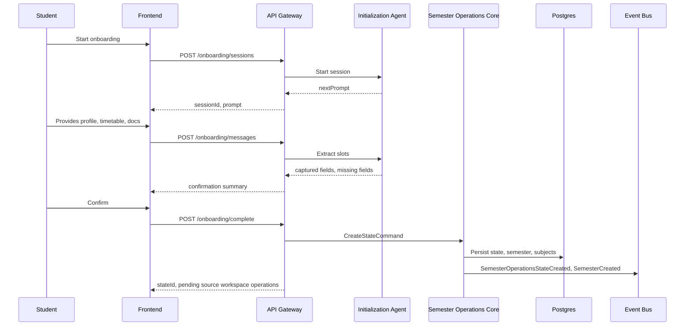

### 19.2 Document Handoff and Source Workspace Upload

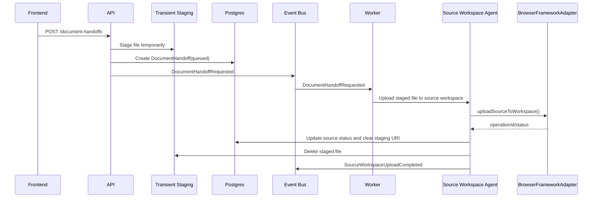

### 19.3 Ask Academic Question

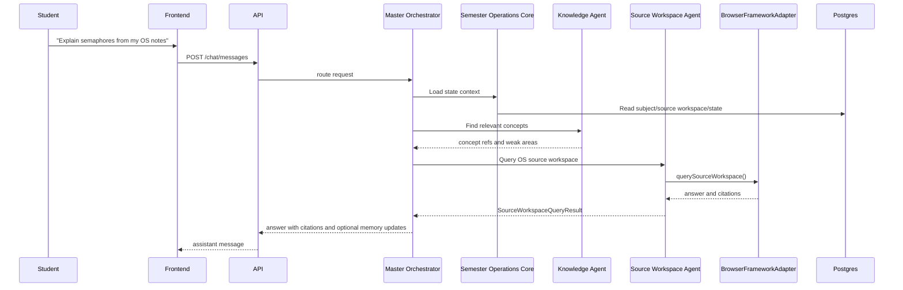

### 19.4 Marks Update to Risk Recompute

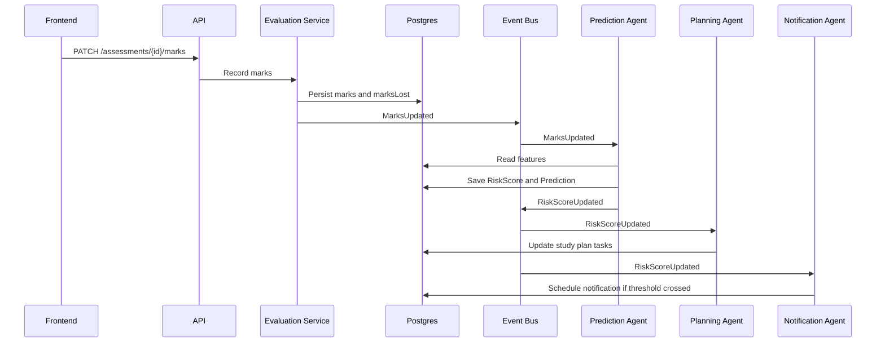

### 19.5 Study Plan Generation

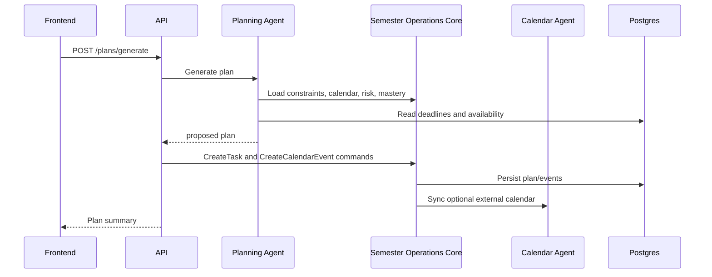

## 20. Data Flow Diagrams

### 20.1 Ingestion Data Flow

```mermaid
flowchart LR
    Files["Uploaded Files"] --> Object["Transient Staging"]
    Files --> Metadata["Handoff Metadata"]
    Metadata --> SourceWorkspaceOps["Source Workspace Operations"]
    SourceWorkspaceOps --> Browser["BrowserFrameworkAdapter"]
    Browser --> Source Notebook Workspace["Source Notebook Workspace"]
    Browser --> Cleanup["Delete Staged File"]
    Metadata --> KG["Knowledge Graph Metadata"]
    KG --> State["Semester Operations State"]
```

### 20.2 Reasoning Data Flow

```mermaid
flowchart LR
    Query["User Query"] --> Master["Master Orchestrator"]
    Master --> TwinSummary["State Summary"]
    Master --> RelevantState["Relevant Domain State"]
    Master --> Agent["Selected Agent"]
    Agent --> LLM["LLM Provider"]
    Agent --> source workspace["Source Notebook Workspace if needed"]
    Agent --> StructuredOutput["Structured Output"]
    StructuredOutput --> Commands["Proposed Commands"]
    StructuredOutput --> Response["User Response"]
    Commands --> Core["Semester Operations Core"]
```

## 21. Frontend Design

### 21.1 Product Shape

The frontend is a mission-control interface. The first screen must show operational truth, not marketing copy.

Primary layout:

- Left navigation rail.
- Top command/search/chat launcher.
- Main command dashboard.
- Right contextual panel for risk, next actions, and agent activity on desktop.
- Mobile bottom navigation with compact cards.

### 21.2 Required Views

#### Command Center

Purpose: answer "What matters now?"

Widgets:

- Today's schedule.
- Current class and next class.
- Today's priorities.
- Risk alerts.
- Study recommendations.
- Upcoming deadlines.
- Upcoming exams.
- Notification inbox.
- Quick actions.

#### Semester View

Widgets:

- Subject grid.
- credit weights.
- marks progress.
- attendance summary.
- source workspace sync status.
- evaluation plan completion.

#### Subject View

Widgets:

- subject overview.
- next lectures.
- uploaded files.
- source workspace status.
- concept mastery.
- assignments.
- assessments and marks.
- subject chat.

#### Calendar View

Widgets:

- weekly timetable.
- assessment dates.
- study sessions.
- deadlines.
- external sync status.

#### Knowledge Graph View

Widgets:

- graph visualization.
- concept details.
- weak concepts.
- prerequisite chains.
- external source references.

#### Prediction View

Widgets:

- SGPA forecast.
- grade scenarios.
- risk trend.
- "what score do I need?" calculator.

#### Chat View

Capabilities:

- scoped chat by semester/subject.
- source-aware answers.
- planning mode.
- action proposals requiring confirmation.
- visible citations when Source Notebook Workspace is used.

#### Notifications View

Capabilities:

- mark read.
- snooze.
- action buttons.
- delivery status.

#### Settings View

Capabilities:

- profile.
- academic preferences.
- notification preferences.
- integrations.
- data export/delete.

### 21.3 Dark Theme Design System

Baseline:

- Background: dark neutral, not a single-hue purple/blue-only theme.
- Cards: max 8px radius unless local design system requires otherwise.
- Use restrained colored accents for domain severity and subject identity.
- Avoid decorative orbs/blobs.
- Use icons for actions.
- Use tables/lists for operational density.

Status colors:

- success: green.
- warning: amber.
- danger: red.
- info: blue.
- neutral: gray.

### 21.4 Frontend State Rules

- Server state is fetched through typed API clients.
- Optimistic updates only for low-risk UI interactions like read/dismiss notification.
- Academic mutations wait for server confirmation.
- Long-running operations show job status.
- WebSocket/SSE updates refresh dashboard projections.

### 21.5 No Business Logic Rule

Frontend may format:

- dates.
- durations.
- percentages.
- status labels.

Frontend must not compute:

- SGPA.
- risk score.
- study plan.
- grade prediction.
- attendance eligibility.
- marks lost except display-only from API data.

## 22. Backend Architecture

### 22.1 Layers

```text
controllers -> application commands/queries -> domain services -> repositories -> infrastructure
```

### 22.2 Modules

#### Auth Module

Owner: Person 4  
Responsibilities:

- JWT issuing/validation.
- password auth for MVP.
- user identity.
- middleware.

#### State Module

Owner: Person 1  
Responsibilities:

- aggregate orchestration.
- state recompute.
- snapshotting.
- audit event emission.

#### Semester Module

Owner: Person 4  
Responsibilities:

- semesters.
- subjects.
- timetable events.

#### Evaluation Module

Owner: Person 2 and Person 4  
Responsibilities:

- evaluation plans.
- assessments.
- marks.
- grade calculations.
- SGPA scenarios.

#### Knowledge Module

Owner: Person 2  
Responsibilities:

- concept graph.
- mastery.
- document concept mapping.

#### Planning Module

Owner: Person 2  
Responsibilities:

- study plans.
- tasks.
- calendar suggestions.

#### source workspace Module

Owner: Person 1 and Person 2  
Responsibilities:

- Source Notebook Workspace domain records.
- calls to `SourceNotebookService`.
- source sync status.

#### Notification Module

Owner: Person 4  
Responsibilities:

- notifications.
- provider adapters.
- preferences.
- scheduled delivery.

#### Agent Runtime Module

Owner: Person 2  
Responsibilities:

- agent execution.
- prompt rendering.
- structured output validation.
- prompt history.

#### Importer Module

Owner: Person 4  
Responsibilities:

- timetable import.
- document handoff orchestration.
- evaluation plan import.
- transient staging cleanup.

## 23. Service Contracts

### 23.1 `SemesterOperationsStateService`

```ts
interface SemesterOperationsStateService {
  createState(command: CreateStateCommand): Promise<SemesterOperationsStateDto>;
  getState(userId: ID): Promise<SemesterOperationsStateDto>;
  getAcademicState(userId: ID): Promise<AcademicStateDto>;
  recomputeState(command: RecomputeStateCommand): Promise<JobDto>;
  applyPatch(command: ApplyStatePatchCommand): Promise<SemesterOperationsStateDto>;
  createSnapshot(command: CreateSnapshotCommand): Promise<SnapshotDto>;
}
```

### 23.2 `EvaluationService`

```ts
interface EvaluationService {
  importPlan(command: ImportEvaluationPlanCommand): Promise<JobDto>;
  createPlan(command: CreateEvaluationPlanCommand): Promise<EvaluationPlanDto>;
  recordMarks(command: RecordMarksCommand): Promise<AssessmentDto>;
  computeSgpa(command: ComputeSgpaCommand): Promise<SgpaScenarioDto>;
  computeMarksNeeded(command: MarksNeededCommand): Promise<MarksNeededDto>;
}
```

### 23.3 `KnowledgeGraphService`

```ts
interface KnowledgeGraphService {
  extractConcepts(command: ExtractConceptsCommand): Promise<JobDto>;
  getGraph(query: KnowledgeGraphQuery): Promise<KnowledgeGraphDto>;
  getConcept(conceptId: ID): Promise<ConceptDto>;
  updateMastery(command: UpdateMasteryCommand): Promise<ConceptMasteryDto>;
  findWeakConcepts(query: WeakConceptQuery): Promise<ConceptMasteryDto[]>;
}
```

### 23.4 `PlanningService`

```ts
interface PlanningService {
  generatePlan(command: GeneratePlanCommand): Promise<StudyPlanDto>;
  acceptPlan(command: AcceptPlanCommand): Promise<StudyPlanDto>;
  updateTask(command: UpdateTaskCommand): Promise<TaskDto>;
  getCurrentPlan(userId: ID): Promise<StudyPlanDto | null>;
}
```

### 23.5 `SourceNotebookService`

```ts
interface SourceNotebookService {
  createSubjectWorkspace(command: CreateSubjectWorkspaceCommand): Promise<SourceWorkspaceDto>;
  uploadSource(command: UploadSourceWorkspaceSourceCommand): Promise<SourceWorkspaceSourceDto>;
  ask(command: AskSourceWorkspaceCommand): Promise<SourceWorkspaceAnswerDto>;
  syncStatus(query: SourceWorkspaceStatusQuery): Promise<SourceWorkspaceStatusDto>;
}
```

Implementation rule:

- `SourceNotebookService` may call `BrowserFrameworkAdapter`.
- It may not know BrowserFrameworkAdapter internals.
- It may not build a local RAG fallback from uploaded lecture documents in MVP.

### 23.6 `PredictionService`

```ts
interface PredictionService {
  recomputeRisk(command: RecomputeRiskCommand): Promise<JobDto>;
  getRisk(query: RiskQuery): Promise<RiskScoreDto[]>;
  getPredictions(query: PredictionQuery): Promise<PredictionDto[]>;
  runScenario(command: PredictionScenarioCommand): Promise<PredictionScenarioDto>;
}
```

## 24. Implementation Decisions

### 24.1 Backend Language

Decision: TypeScript with Node.js for MVP backend.

Justification:

- Shared types with frontend.
- Fast hackathon velocity.
- Strong ecosystem for REST, queues, validation, and OpenAPI.
- BrowserFrameworkAdapter client can remain language-neutral.

Alternative:

- Python/FastAPI is strong for AI, but frontend/backend type sharing is weaker. Python remains acceptable for agent workers if isolated behind contracts.

### 24.2 Frontend Framework

Decision: React + TypeScript + Vite.

Justification:

- Fast MVP.
- Rich visualization ecosystem.
- Easy PWA support.
- Strong type sharing.

### 24.3 Database

Decision: PostgreSQL for canonical structured state.

Justification:

- Strong relational model for academic domain.
- Transactions for command handlers.
- Works for MVP and production.
- Can host vector search via pgvector if needed.

### 24.4 Queue

Decision: Redis-backed queue for MVP.

Justification:

- Agent tasks and BrowserFrameworkAdapter operations are asynchronous.
- Supports retry and background jobs.
- Easy local Docker Compose.

### 24.5 Vector Store

Decision: pgvector for MVP if simplicity wins, Qdrant for production or advanced search.

Justification:

- MVP avoids another moving part.
- Interface keeps migration possible.

### 24.6 Knowledge Graph Store

Decision: Postgres graph tables for MVP; Neo4j optional in production.

Justification:

- MVP graph traversal needs are small.
- Repository interface prevents lock-in.

### 24.7 LLM Provider

Decision: provider-agnostic `LLMService`.

Justification:

- Agents should not hardcode model vendors.
- Prompts and structured outputs can be evaluated independently.

### 24.8 Source Notebook Workspace

Decision: treat Source Notebook Workspace as external worker accessed through BrowserFrameworkAdapter.

Justification:

- Avoids product coupling to Source Notebook Workspace.
- Keeps raw academic content in the external workspace selected by the user.
- Preserves Browser Automation core IP boundary.

## 24A. Execution Tech Stack and Build Approach

This section is binding for hackathon execution. The team should not spend time debating foundational stack choices during implementation.

### 24A.1 MVP Tech Stack

Frontend:

- React 19 or latest stable React available to the team.
- TypeScript.
- Vite.
- Tailwind CSS or CSS modules; choose one and do not mix.
- TanStack Query for server state.
- Zustand for small client UI state if needed.
- Recharts or lightweight SVG/canvas for charts.
- React Flow or Cytoscape.js for concept graph visualization.

Backend:

- Node.js 22 LTS or latest available LTS.
- TypeScript.
- Fastify preferred for speed and schema validation; Express acceptable if team is faster with it.
- Zod for request validation and shared DTO parsing.
- Prisma or Drizzle for Postgres access; choose one. Recommendation: Prisma for hackathon speed.
- BullMQ for Redis-backed jobs.
- Server-Sent Events for chat/job progress; WebSocket optional.

Browser Framework:

- Python 3.12.
- Playwright.
- Existing `Browser API/poc.py` refactored into importable modules.
- JSON CLI wrapper consumed by backend worker.
- Persistent profile directories under `browser/profiles/{userId}/{provider}`.
- Adapter JSON files per external workspace.

Database and Queue:

- PostgreSQL 16.
- Redis 7.
- Optional pgvector only for agent memory summaries, not uploaded lecture content.

Testing:

- Vitest for frontend and shared TypeScript.
- Playwright for UI smoke tests.
- Jest/Vitest or Node test runner for backend.
- Pytest for browser framework wrapper.

Deployment:

- Docker Compose for local/demo.
- Frontend static host for demo.
- Backend and worker as separate containers.
- Browser worker local on demo machine if provider login/browser UI is required.

### 24A.2 Monorepo Package Layout

Recommended package layout:

```text
semester-operations-command-center/
  frontend/                 # React/Vite app
  backend/                  # Fastify API
  agents/                   # agent registry, schemas, prompt orchestration
  browser/                  # Python wrapper around existing Browser API framework
  shared/                   # DTOs, Zod schemas, generated clients
  database/                 # Prisma/SQL migrations and seeds
  deployment/               # Docker Compose and deployment scripts
```

### 24A.3 Backend Implementation Steps

1. Create Fastify app with `/health`, auth middleware, request ID middleware, and error envelope.
2. Add shared Zod schemas in `shared/`.
3. Create Prisma schema for users, semesters, subjects, timetable, evaluation, marks, source workspaces, document handoffs, agent runs, notifications, and outbox events.
4. Implement repositories only after schemas are stable.
5. Implement command handlers for onboarding, timetable import, document handoff, source workspace operations, marks, and plans.
6. Add BullMQ worker for document handoff, source workspace operations, agent runs, notifications, and state recompute.
7. Add SSE endpoint for job/chat progress.
8. Wire `BrowserFrameworkAdapter.ts` to call the Python CLI wrapper.

### 24A.4 Browser Framework Refactor Steps

Person 1 owns this path.

1. Keep `poc.py` behavior intact.
2. Extract adapter loading into `browser/framework/adapter_loader.py`.
3. Extract persistent session launch into `browser/framework/browser_session.py`.
4. Extract chat operations into `browser/framework/chat_runtime.py`.
5. Extract response stability logic into `browser/framework/response_collector.py`.
6. Add `browser/runner/browser_framework_cli.py`.
7. CLI accepts:
   - `initialize-session`
   - `import-cookies`
   - `open-target`
   - `send-chat-message`
   - `list-recent-chats`
   - `create-source-workspace`
   - `upload-source`
   - `query-source-workspace`
   - `status`
8. CLI reads JSON from stdin or `--input path`.
9. CLI writes JSON to stdout.
10. CLI never prints logs to stdout; logs go to stderr or log file.

### 24A.5 Agent Implementation Steps Using Chat Conversations

Person 2 owns this path.

1. Create `configs/agents.registry.json`.
2. Create one dedicated connected chat conversation per agent.
3. Paste the bootstrap prompt from `prompts/{agentId}/system.md`.
4. Store each chat URL in the registry.
5. Implement `AgentRunner` that:
   - loads agent registry.
   - wraps task input in `agentTask`.
   - calls `BrowserFrameworkAdapter.sendChatMessage`.
   - extracts JSON from response.
   - validates with Zod schema.
   - retries once with a repair prompt if invalid.
6. Store `agent_runs` metadata in Postgres.
7. Return proposed commands to backend command handlers.

### 24A.6 Frontend Implementation Steps

Person 3 owns this path.

1. Build app shell: left nav, top command bar, main dashboard, right context panel.
2. Implement API client from shared DTOs.
3. Build Command Center first:
   - current/next class.
   - today's priorities.
   - deadlines.
   - risk cards.
   - source workspace status.
   - chat entry.
4. Build Onboarding flow:
   - profile.
   - subjects.
   - timetable import.
   - evaluation plan import.
   - source workspace connection.
   - cookies/manual-login connection status.
5. Build Subject view, Calendar view, Grades view, Chat view.
6. Add SSE progress indicators.

### 24A.7 Infrastructure Implementation Steps

Person 4 owns this path.

1. Docker Compose with Postgres, Redis, backend, worker.
2. Database migration command.
3. Seed command with sample semester/timetable/evaluation data.
4. CI checks:
   - typecheck.
   - lint.
   - unit tests.
   - backend build.
   - frontend build.
   - Python wrapper smoke test.
5. Add cleanup worker for transient upload staging.
6. Add `.env.example`.
7. Add deployment README.

### 24A.8 MVP Build Rule

Do not build a local document knowledge base in MVP. The only allowed content path is:

```text
user upload -> transient staging -> Browser Framework -> external subject workspace -> delete staged file -> store metadata/status
```

The backend stores operational state and references. It does not store lecture content.

## 25. Security, Privacy, and Compliance

### 25.1 Data Classification

Sensitive:

- user identity.
- academic records.
- marks.
- transient upload files during handoff.
- prompt history.
- agent memory.
- browser session metadata.

### 25.2 Controls

- TLS for all network traffic.
- Encrypt data at rest.
- JWT auth with refresh tokens.
- Per-user authorization filters.
- Secrets only in environment or secret manager.
- Audit logs for mutations and agent writes.
- Redact logs.
- Do not store browser credentials.
- Do not expose BrowserFrameworkAdapter profile paths.

### 25.3 User Rights

The system must support:

- export own data.
- delete own data.
- delete memories.
- disconnect integrations.
- view audit history.

### 25.4 Agent Safety

- Agents cannot execute arbitrary browser tasks.
- Agents cannot delete data without explicit command authorization.
- High-impact actions require user confirmation:
  - deleting documents.
  - sending external notifications.
  - modifying external calendars.
  - changing grades/marks.

## 26. Testing Strategy

### 26.1 Unit Tests

Owners: module owners.

Coverage:

- domain calculations.
- SGPA and marks-needed calculations.
- timetable parsing.
- validation schemas.
- risk threshold logic.
- repository mapping.

### 26.2 Integration Tests

Owner: Person 4.

Coverage:

- API to DB.
- command handler to event outbox.
- document upload to parse queue.
- marks update to risk recompute event.
- SourceNotebookService with mocked BrowserFrameworkAdapter.

### 26.3 Agent Tests

Owner: Person 2.

Coverage:

- intent routing fixtures.
- prompt output schema validation.
- concept extraction fixtures.
- planning fixtures.
- hallucination guard tests.
- evaluation plan extraction examples.

### 26.4 API Tests

Owner: Person 4.

Coverage:

- auth.
- authorization boundaries.
- validation errors.
- idempotency.
- rate limits.
- all API contracts in OpenAPI.

### 26.5 UI Tests

Owner: Person 3.

Coverage:

- dashboard renders.
- mobile layout.
- chat send and receive.
- calendar navigation.
- knowledge graph nonblank.
- risk cards display.
- no text overflow in core cards/buttons.

### 26.6 Smoke Tests

Owner: Person 1.

Required smoke path:

1. Register/login.
2. Complete onboarding.
3. Import timetable.
4. Upload document.
5. Create source workspace through mocked BrowserFrameworkAdapter or real service in demo mode.
6. Ask subject question.
7. Record marks.
8. See risk update.
9. Generate study plan.

### 26.7 Regression Tests

Owners: all.

Triggered on PR to `develop` and `main`.

Must include:

- all domain unit tests.
- API contract tests.
- agent schema tests.
- frontend build.

### 26.8 Acceptance Tests

Acceptance scenario: "Student Command Center Works"

- Given a student has Semester 2 data, timetable, subjects, and evaluation plan.
- When the student opens the dashboard.
- Then the system shows current/next class, today's priorities, upcoming assessments, and risk cards.
- When the student asks "What should I study today?"
- Then the system returns a plan based on deadlines, risk, marks, and concept mastery.
- When the student updates marks.
- Then SGPA/risk projections update and a recommendation changes.

## 27. Git Workflow

### 27.1 Branches

- `main`: production/demo stable.
- `develop`: integration branch.
- `feature/*`: feature work.
- `release/*`: release stabilization.
- `hotfix/*`: urgent fixes from main.

### 27.2 Pull Requests

Rules:

- All work enters through PR.
- PRs require at least one reviewer.
- Person 1 approval required for:
  - Browser API.
  - interfaces.
  - architecture docs.
  - cross-module changes.
  - final merge to main.
- Person 2 approval required for agent/prompt changes.
- Person 3 approval required for shared UI components.
- Person 4 approval required for migrations/deployment/auth.

### 27.3 Branch Protection

`main`:

- no direct push.
- CI required.
- at least two approvals.
- Person 1 approval required.

`develop`:

- no direct push after day 1.
- CI required.
- at least one approval.

### 27.4 Commit Convention

Use Conventional Commits:

- `feat: add risk summary endpoint`
- `fix: handle idempotent document uploads`
- `docs: add BrowserFrameworkAdapter contract`
- `test: add SGPA scenario tests`
- `refactor: split evaluation repository`
- `chore: update docker compose`

### 27.5 Sprint Workflow

Daily:

- morning task assignment.
- midday integration checkpoint.
- evening demo branch smoke test.

Day 1:

- repo scaffold.
- shared contracts.
- database schema.
- frontend shell.
- BrowserFrameworkAdapter mock.

Day 2:

- onboarding.
- timetable import.
- semester/subject APIs.

Day 3:

- document upload.
- source workspace operations.
- knowledge graph MVP.

Day 4:

- evaluation plan.
- marks.
- risk calculations.

Day 5:

- chat orchestration.
- planning agent.
- dashboard integration.

Day 6:

- notifications.
- UI polish.
- smoke tests.

Day 7:

- demo script.
- final bug fixes.
- deploy.
- documentation freeze.

## 28. Team Ownership Matrix

| Area            | Person 1 Chief Architect | Person 2 AI Systems | Person 3 Frontend | Person 4 Infrastructure |
| --------------- | ------------------------ | ------------------- | ----------------- | ----------------------- |
| Architecture    | A/R                      | C                   | C                 | C                       |
| Interfaces      | A/R                      | C                   | C                 | C                       |
| Browser API     | A/R                      | I                   | I                 | I                       |
| Master Agent    | A/R                      | R                   | I                 | C                       |
| Agents          | C                        | A/R                 | I                 | C                       |
| Prompts         | C                        | A/R                 | I                 | I                       |
| Knowledge Graph | C                        | A/R                 | C                 | C                       |
| Prediction      | C                        | A/R                 | I                 | C                       |
| Dashboard       | C                        | C                   | A/R               | I                       |
| Chat UI         | C                        | C                   | A/R               | I                       |
| APIs            | A/R                      | C                   | I                 | R                       |
| Database        | C                        | C                   | I                 | A/R                     |
| Auth            | C                        | I                   | I                 | A/R                     |
| Notifications   | C                        | C                   | C                 | A/R                     |
| CI/CD           | A                        | I                   | I                 | R                       |
| Deployment      | A                        | I                   | C                 | R                       |
| Final Merge     | A/R                      | I                   | I                 | I                       |

Legend:

- A: accountable.
- R: responsible.
- C: consulted.
- I: informed.

## 29. Deployment Architecture

### 29.1 Hackathon MVP Deployment

```mermaid
flowchart TB
    BrowserUser["Student Browser"] --> Vercel["Frontend Static Host"]
    Vercel --> API["Backend API Container"]
    API --> Postgres["Postgres"]
    API --> Redis["Redis Queue"]
    API --> Worker["Worker Container"]
    Worker --> BrowserSvc["BrowserFrameworkAdapter Black Box"]
    Worker --> LLM["LLM Provider"]
    Worker --> Storage["Local/S3 Storage"]
    BrowserSvc --> Source Notebook Workspace["Source Notebook Workspace"]
```

MVP deployment choices:

- Frontend: Vercel/Netlify/static hosting.
- Backend: Railway/Render/Fly.io/cloud VM.
- Database: managed Postgres or Docker Compose for demo.
- Queue: Redis.
- BrowserFrameworkAdapter: separate service controlled by Person 1.
- Environment: single demo environment.

MVP constraints:

- one to small number of users.
- manual login for Source Notebook Workspace if needed.
- limited retention.
- basic monitoring.

### 29.2 Production Deployment

```mermaid
flowchart TB
    CDN["CDN"] --> FE["Frontend"]
    FE --> WAF["WAF/API Gateway"]
    WAF --> Auth["Auth Service"]
    WAF --> API["API Service"]
    API --> DB["Managed Postgres Multi-AZ"]
    API --> Cache["Redis Cluster"]
    API --> Queue["Managed Queue"]
    API --> Obj["Encrypted Transient Staging"]
    Queue --> AgentWorkers["Agent Worker Pool"]
    Queue --> ImportWorkers["Importer Workers"]
    Queue --> NotificationWorkers["Notification Workers"]
    AgentWorkers --> Vector["Vector DB"]
    AgentWorkers --> Graph["Graph DB"]
    AgentWorkers --> LLM["LLM Providers"]
    AgentWorkers --> BrowserClient["BrowserFrameworkAdapter Client"]
    BrowserClient --> BrowserSvc["BrowserFrameworkAdapter Private Service"]
    BrowserSvc --> Source Notebook Workspace["Source Notebook Workspace"]
    NotificationWorkers --> Push["Push/Email/SMS Providers"]
    API --> Observability["Logs/Metrics/Tracing"]
    AgentWorkers --> Observability
```

Production requirements:

- horizontal scaling for API and workers.
- isolated BrowserFrameworkAdapter network.
- managed secrets.
- observability.
- backups.
- disaster recovery.
- rate limiting.
- data export/delete pipeline.

## 30. Observability

### 30.1 Logs

Log:

- requestId.
- userId hash.
- endpoint.
- latency.
- status code.
- agent run ID.
- external operation ID.

Do not log:

- raw transient upload files.
- passwords.
- tokens.
- full prompt content by default.
- browser profile paths.

### 30.2 Metrics

Required:

- API latency.
- API error rate.
- agent run latency.
- agent failure rate.
- BrowserFrameworkAdapter operation failure rate.
- document handoff duration.
- source workspace upload duration.
- risk recompute duration.
- notification delivery success.

### 30.3 Tracing

Trace across:

- API request.
- command handler.
- DB transaction.
- event publication.
- worker job.
- agent run.
- BrowserFrameworkAdapter operation.

## 31. MVP Acceptance Definition

The MVP is complete when:

- User can onboard with profile, semester, subjects, timetable, and evaluation plan.
- Dashboard shows current/next class, today's schedule, priorities, deadlines, risk, and prediction cards.
- User can upload lecture material.
- System creates or links Source Notebook Workspaces per subject through BrowserFrameworkAdapter interface.
- User can ask a subject-scoped question and receive a source-aware answer.
- User can record marks and see marks lost, grade projection, and risk update.
- User can generate a study plan from current state.
- Notifications exist at least in-app.
- BrowserFrameworkAdapter is used only through interface.
- No business logic exists in frontend.
- Smoke test path passes.

## 32. Future Extensions

Designed extension points:

- LMS connectors.
- Google Calendar sync.
- Google Drive import.
- GitHub project awareness.
- Notion/Docs sync.
- institutional grade import.
- mobile app.
- advisor/parent sharing with permission.
- cohort analytics with anonymization.
- optional future local knowledge mode, only with explicit user consent.
- advanced knowledge tracing model.
- spaced repetition engine.
- voice input.
- multi-student classroom mode.

Extension rule:

- Add adapters at edges.
- Do not fork the Semester Operations state model.
- Do not bypass interfaces.

## 33. Build Order for Four Engineers

### Person 1

Immediate tasks:

- Create monorepo.
- Add `interfaces/Interface.md`.
- Define BrowserFrameworkAdapter mock.
- Define OpenAPI skeleton.
- Set PR ownership rules.
- Build Master Orchestrator shell.
- Wire integration smoke path.

### Person 2

Immediate tasks:

- Create prompt templates.
- Implement agent schemas.
- Implement Initialization, Planning, Evaluation, and Knowledge MVP agents.
- Define concept extraction output.
- Implement risk heuristics.
- Build agent tests.

### Person 3

Immediate tasks:

- Build dark command-center shell.
- Implement dashboard cards.
- Implement timetable/calendar view.
- Implement subject view.
- Implement chat UI.
- Implement knowledge graph visualization placeholder.
- Connect typed API client.

### Person 4

Immediate tasks:

- Backend API scaffold.
- Auth.
- Postgres schema/migrations.
- Repositories.
- document upload/importer.
- queue/worker setup.
- notifications.
- deployment compose/CI.

## 34. Critical Risks and Mitigations

| Risk | Impact | Mitigation |
|---|---|---|
| BrowserFrameworkAdapter unavailable | Source Notebook Workspace operations fail | Provide mock, manual source workspace link fallback, retry queue |
| Source Notebook Workspace UI changes | upload/query fails | Keep BrowserFrameworkAdapter black-box; surface typed errors; allow manual operation |
| Agent hallucination | wrong advice | structured outputs, evidence refs, deterministic calculations for grades/risk |
| Scope explosion | MVP misses demo | freeze MVP acceptance path; future items documented but not built |
| Bad data extraction | incorrect state | `needsReview` flags and user confirmation |
| Frontend embeds logic | inconsistent state | API-owned calculations; code review rule |
| Unclear ownership | merge conflicts | ownership matrix and branch protection |
| Privacy issue | user trust loss | minimization, redaction, user deletion, audit logs |

## 35. Required Documentation Artifacts

The repository must include:

- `docs/Semester_Operations_Command_Center_SDD.md`
- `interfaces/Interface.md`
- `interfaces/openapi.yaml`
- `interfaces/events.md`
- `interfaces/browser-service.md`
- `database/ERD.md`
- `prompts/README.md`
- `deployment/README.md`
- `tests/ACCEPTANCE.md`
- `docs/ADR/0001-architecture-style.md`
- `docs/ADR/0002-browser-service-boundary.md`
- `docs/ADR/0003-database-choice.md`

## 36. Final Architectural Position

Semester Operations Command Center is a persistent academic state engine with a mission-control interface and multi-agent reasoning layer.

The central object is `SemesterOperationsState`.

The core product loop is:

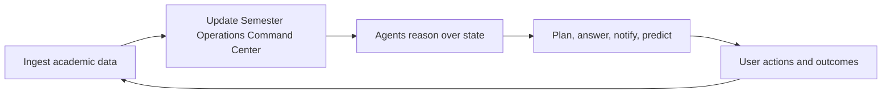

Everything else is an application or worker around that loop.

Source Notebook Workspace is a worker. Browser Automation is an execution layer. Semester Operations Command Center is the product.
